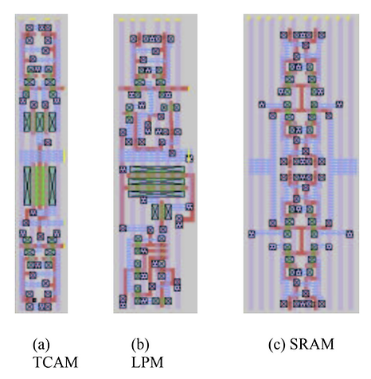

# A Fast Ternary CAM Design for IP Networking Applications

This post lists the abstract and links to the paper I wrote with two others describing a TCAM we designed and simulated. It was published in 2003. I'm posting it so I can more easily find it and share it with others. I did the physical design, simulated the cells with SPICE, and built a "switch level" model of the entire circuit.

###### Abstract

This paper presents a VLSI implementation and the complete circuit design of a high-speed Ternary Content Addressable Memory (TCAM). TCAMs are crucial components for performing routing lookups within the core infrastructure of IP networks and smaller gateways. We have developed a TCAM that surpasses the current commercial offerings in terms of both capacity and speed.

Our approach distinguishes itself from existing TCAM designs by allowing unprecedented flexibility in the insertion location of new entries. We achieve this through an innovative Longest Prefix Match (LPM) determination circuit, which has a delay that only increases logarithmically with the number of bits in the lookup process. Our TCAM implementation boasts 512 bits for prefix entry alongside 512 bits for destination information, enabling it to conduct extensive address lookups as well as support quality of service (QoS) mechanisms. These features render our TCAM design especially well-suited for IPv6 routing lookup applications.

The enhanced speed of our TCAM compared to current market options is the result of judiciously chosen VLSI architectural and implementation strategies. The design consists of a 21 Mb TCAM, organized into a regular array of 13 x 13 smaller TCAM blocks, optimizing the speed characteristics. To achieve maximum throughput, routing lookup operations are executed using a deeply pipelined approach, maintaining a lookup latency of only three clock cycles. We have reduced the RC delay during the lookup process by splitting the match lines within these blocks into four segments. Additionally, our LPM determination circuit incorporates a highly efficient Wired-NOR configuration to minimize delay further. To expedite the lookup speed, sense amplifiers are integrated within the LPM and SRAM portions of the TCAM, centrally located in each sub-block.

The design and verification of our TCAM have been conducted using the latest circuit analysis and design tools. Mask layouts for the entire TCAM design have been generated with contemporary layout tools. The complete TCAM circuit occupies approximately 18mm squared, with an overall capacity of 21Mb. Notably, our TCAM is capable of routing lookups at a line rate of 76.8Gb/s, which is double the speed of the fastest commercial TCAMs available today.

###### Paper

 [a-fast-ternary-cam-design-for-ip-networking-applications.pdf](a-fast-ternary-cam-design-for-ip-networking-applications.pdf) 