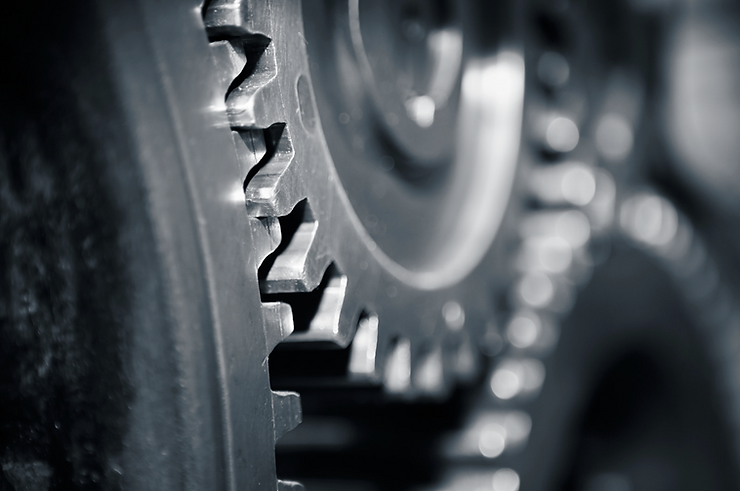

# A Machine to Support Autonomic Computing

This post links to a 2005 paper that delved into the world of autonomic computing from IBM's Autonomic Computing initiative. This paper proposed groundwork for a self-reliant IT system that would ultimately lead to the developing of an innovative Autonomic CPU. This CPU, composed of interworking 'Cogs,' would help embed "autonomic self-managing properties" into computing technology.

Link to the doc:

 [a-machine-to-support-autonomic-computing.pdf](a-machine-to-support-autonomic-computing.pdf) 

###### Reference

This and other work @

[<u>https://www.researchgate.net/scientific-contributions/Z-Pfeffer-11999069</u>](https://www.researchgate.net/scientific-contributions/Z-Pfeffer-11999069)