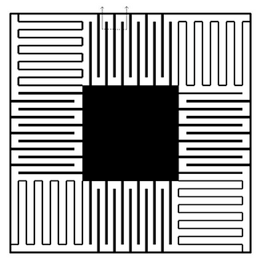

# A MEMS-CMOS Tri-Axial Rate Gyroscope Controlled Using a Time-MultiplexedSensor-Actuator Architecture

This post presents a paper describing a MEMS-CMOS gyroscope I designed for a course at the University of Colorado. I'm posting it so I can more easily find it.

###### Abstract

In this paper, we present a novel tri-axial rate gyroscope design, beginning with a review of gyroscope physics and the specific applications for which the gyro is intended. The design features a unique method of operation where CMOS metal layers are employed for both sensing and activation across all three axes—a technique previously considered only for the sensing of z-axis vibrations, not for their activation.

The paper then elaborates on the electronics required to support the activation and sensing functions of the gyro. These electronics are distinctive in that they incorporate the sensing capacitance directly into a switched capacitor amplifier, and they stand out due to the time-multiplexed operation of each activation and sensing mode.

Adding to the originality of the design is the proposal of a braking stage between each sensing and activation step. This innovation aims to allow for faster transitions between axial measurements. Finally, the paper concludes with a recommendation for a suitable foundry to realize the proposed design.

###### Paper

[a-mems-cmos-tri-axial-rate-gyroscope-controlled-using-a-time-multiplexedsensor-actuator-architecture.pdf](a-mems-cmos-tri-axial-rate-gyroscope-controlled-using-a-time-multiplexedsensor-actuator-architecture.pdf) 
