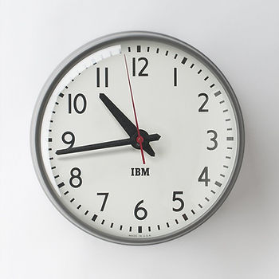

# A way to create a plan

This post lists a way to create a plan.

**Most Important Point**

The most important part of planning is to agree on the plan. The following steps may help get to an agreement.

**Steps**

1\. Write down:

-   What needs to get done
    
-   When it needs to be done
    
-   Who is going to work on it
    

This shouldn't be longer than **2 pages**.

If any of these aren't known, guess or estimate. List how you came up with the guess or estimate.

2\. List all of the tasks that will need to get done in a list. List what each task depends on.

3\. List whose going to do each task.

4\. List milestones you'll hit.

5\. List whose going to make sure each milestone gets done.

6\. Organize the tasks to hit the milestones or revise the tasks to hit the milestones.

7\. Get an estimate for how long each task will take **from the person doing the tasks**.

**You are a bad manager** you don't try to get the time to finish each task from the actual person doing the task. If you can't get an estimate, state an estimate and state that you came up with it.

**You are a horrible manager** if you don't support your team's estimates to upper management.

Your project **will** fail if you don't get estimate from the person doing the work and if you don't support those estimates.

8\. Put all the tasks into a spreadsheet in an order that ensures that dependent tasks are done before the tasks that depend on them

9\. Get a sign off from the person you're building the plan for ensure you agree on:

-   What needs to get done
    
-   When it needs to be done
    
-   Who is going to work on it
    

**You are a bad manager** if the person says that the time won't work and you just change the estimates without working with your team to make another proposal.

10\. Publish the spreadsheet of tasks where everyone can see it and update it daily

**A note on working against the plan**

If any of the assumptions turn out to be wrong, you **must** look at the plan and see what's impacted. Revise the plan and post the a new spreadsheet of the remaining tasks.

Watch dependencies. If a dependency slips, analyze the impact to the plan, publish a new plan, tell your stakeholders **right away** and show them the new plan.

As you approach a milestone, send out a daily note on progress. If things are very tight, send these hourly.

**Reference**

-   IBM clock from [link](http://www.schoolhouse.com/products/1960s-ibm-standard-issue-clock)