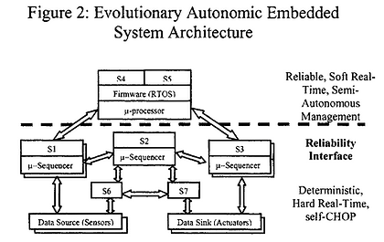

# An Embedded Real-Time Autonomic Architecture

This post lists the abstract and a link to a paper I wrote and published in 2005 with one other person on an autonomic embedded computing architecture.

###### Abstract\*

Autonomic computing represents a new set of architectural goals inspired by the human autonomic system and initially envisioned by IBM, aimed at addressing a looming system administration crisis exacerbated by Moore's Law. As storage, memory, processing, and I/O resources expand at current rates, the traditional management methods will become untenable.

While autonomic architecture is conceived to prevent this crisis, embedded system architecture—which is much simpler than Grid computing—has already begun to integrate features akin to self-management. This is exemplified by mostly autonomous deep space probes equipped with FDIR (Fault Detection, Isolation, and Recovery) systems demonstrating self-managing characteristics. Similarly, mainframe and data center architectures have begun to show facets of self-management through RAS (Reliability, Availability, and Serviceability) features.

Historically, embedded systems have frequently been behind the forefront of computer architecture, often utilizing slower and smaller-scale processors than their desktop or mainframe counterparts. However, the autonomic architecture proposes four primary objectives for systems: to be self-configuring, self-healing, self-optimizing, and self-protecting.

In our paper, we explore how the goals of autonomic architecture can be applied to real-time embedded systems rather than the enterprise systems IBM has typically focused on.

\* This copy of the abstract has been cleaned up and improved a little

###### Paper

 [an-embedded-real-tome-autonomic-architecture.pdf](an-embedded-real-tome-autonomic-architecture.pdf) 