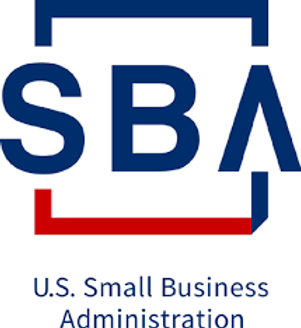

# Army 20.1 SBIR TABA Funding Clarification: is $5k "On Top" of the $167,500 Available?

This post lists the answers I got to my questions: 1) Is the $5000 Technical and Business Assistance (TABA) assistance "on top" of the $167,500 available? 2) Where do you submit your TABA provider letter?

**Answers**

I got these answers when I called the number listed on page 1 of ARMY-20.1-v4..pdf, "ARMY 20.1 Small Business Innovation Research (SBIR) Proposal Submission Instructions," and spoke with one of the great people helping to administer the Army's SBIR program.

1) Is TABA assistance "on top" of the $167,500 available?

Yes. You'll list the $5,000 in the Cost Volume through the DoD. It won't get added to the cost calculation.

2) Where do you submit your TABA provider letter?

You should put the "letter" into the Technical Volume. The letter plus the rest of the Technical Volume must not be longer than 20 pages.

**Reference**

SBA Logo from [[link](http://www.sba.gov/brand/visual-identity/logo/)\]