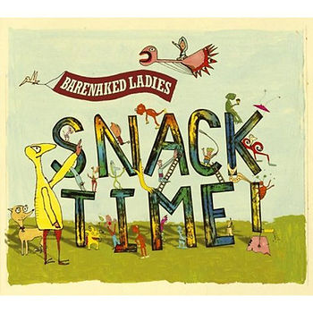

# Barenaked Ladies Crazy ABCs List

All the "crazy ABCs" listed in Snack Time.

A is for [aisle](http://en.wikipedia.org/wiki/Aisle)

B is for [bdellium](http://en.wikipedia.org/wiki/Bdellium)

C is for [czar](http://en.wikipedia.org/wiki/Tsar)

D is for [djinn](http://en.wikipedia.org/wiki/Jinn)

E is for [Euphrates](http://en.wikipedia.org/wiki/Euphrates)

F is for [föhn](http://en.wikipedia.org/wiki/Foehn_wind)

G is for [gnarly](http://en.wikipedia.org/wiki/Glossary_of_surfing#About_the_water)

I is for [irk](http://en.wikipedia.org/wiki/Irk_(disambiguation))

H is for [hour](http://en.wikipedia.org/wiki/Hour)

J is for [Jalapeño](http://en.wikipedia.org/wiki/Jalape%C3%B1o)

K is for [knick knack](http://en.wikipedia.org/wiki/Knick_Knack_(disambiguation))

L is for [llama](http://en.wikipedia.org/wiki/Llama) [(](http://en.wikipedia.org/wiki/Llama)[Monty Python](http://www.youtube.com/watch?v=SII-jhEd-a0)[)](http://en.wikipedia.org/wiki/Llama)

N for [neumonic](http://en.wikipedia.org/wiki/Mnemonic)

M is for [mdomo](http://en.wiktionary.org/wiki/mdomo)

O is for [ouija board](http://en.wikipedia.org/wiki/Ouija)

P is for [pneumonia](http://en.wikipedia.org/wiki/Pneumonia), [pterodactyl](http://en.wikipedia.org/wiki/Pterodactyl_(disambiguation)) and [psychosis](http://en.wikipedia.org/wiki/Psychosis) and [Pfeffer](http://en.wikipedia.org/wiki/Pfeffer)

Q is for [qat](http://en.wikipedia.org/wiki/Qat)

R is not for [argyle](http://en.wikipedia.org/wiki/Argyle)

S is for [Szár](http://en.wikipedia.org/wiki/Sz%C3%A1r)

T is for [tsunami](http://en.wikipedia.org/wiki/Tsunami)

U is for [urn](http://en.wikipedia.org/wiki/Urn)

V is for [vraisemblance](http://en.wikipedia.org/wiki/Vraisemblance)

W is for [wren](http://en.wikipedia.org/wiki/Wren), [wrinkly](http://en.wikipedia.org/wiki/Wrinkle) and [who](http://en.wikipedia.org/wiki/Who) and [Doctor Who](http://en.wikipedia.org/wiki/Doctor_Who)

X is for [Xian](http://en.wikipedia.org/wiki/Xi%27an)

Y is for [yperite](http://en.wikipedia.org/wiki/Sulfur_mustard)

[Zed](http://en.wikipedia.org/wiki/Zed) ehh?

Think outside the box, get into some [Rachmaninoff](http://en.wikipedia.org/wiki/Sergei_Rachmaninoff).

Now:

Listen to the [song](http://www.youtube.com/watch?v=_dvPhtNZCj0)!

Buy the [song](http://www.amazon.com/Crazy-ABCs/dp/B005D59BCK)!

