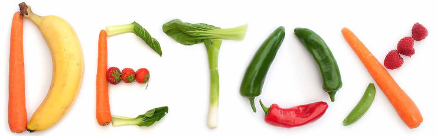

# Can you read this?

How did you feel when you read the title of this post?

Did you feel incredulous?

Did you say to yourself, "of course I **can** read it!"

Maybe you felt **helpful.** You thought, "sure, I can help, I'll read it."

Perhaps you thought something else.

What about this: **Will you read this?**

Did you feel better about this request? Did you feel more open to do it? Did you feel like you had a choice?

In my experience many people prefer to be asked, "will you..." vs. "can you.." for these and other reasons?

If you ask people to do things, you may want to consider asking "will you..." vs. "can you..."

**Can You vs. Will You**

"can" questions a persons ability.

It may be the right word, especially if you need to check if someone is able do something.

Examples:

-   [Usain Bolt](http://en.wikipedia.org/wiki/Usain_Bolt), can you win a Gold at the Olympic games in [Tokyo](http://www.olympic.org/tokyo-2020)?
    
-   [Takeru Kobayashi](http://en.wikipedia.org/wiki/Takeru_Kobayashi), can you eat 111 bunless hot dogs in 10 minute at the New York State Fair?
    
-   [Ron Obvious](http://en.wikipedia.org/wiki/Ron_Obvious_(Monty_Python)), can you jump the English Channel?
    
-   Can you do this by Friday?
    
-   [Elon Musk](http://en.wikipedia.org/wiki/Elon_Musk), can you ramp the production of the [Model 3](http://en.wikipedia.org/wiki/Tesla_Model_3)?

**"Will" May Be a Better Choice of Words**

"will" may be a better choice for a few reasons:

-   It doesn't question their ability
    
-   It allows them to maintain their autonomy
    
-   A "yes" is more of a "[sign up](http://www.hpmd.com/hpmd/WQUOTES.NSF/85256253006987038525612b00479a1b/4b5dbb16e701c494852569970049f6d4?OpenDocument)"
    

**A Balm for Toxic Work Cultures**

I wrote up this blog post after reading, [7 Sure Signs That Your Workplace Is Toxic](http://www.inc.com/marcel-schwantes/7-sure-signs-that-your-workplace-is-toxic.html?cid=sf01003&sr_share=facebook). After reading it I thought, "in my experience, the more I used "will you" instead of "can you," the better my **immediate** workspace became. Let me share this."

**A Little More Background**

I didn't come up with this suggestion myself. It was offered as part of a workplace training that I and the rest of my colleagues received as part of a workplace training offered by an HR manager. This HR manager was trying to address some of the challenges that she saw in our little company and thought this would be a good first step.

Note: I would get my own personalized training at a later company **:)**

**Other Write Ups**

[Can Do vs. Will Do](http://www.productiveflourishing.com/can-do-vs-will-do/)

**References**

"DETOX" picture from [link](http://www.remediesforme.com/wp-content/uploads/2016/01/detox-cleanses-naturally-remove-toxins.jpg)