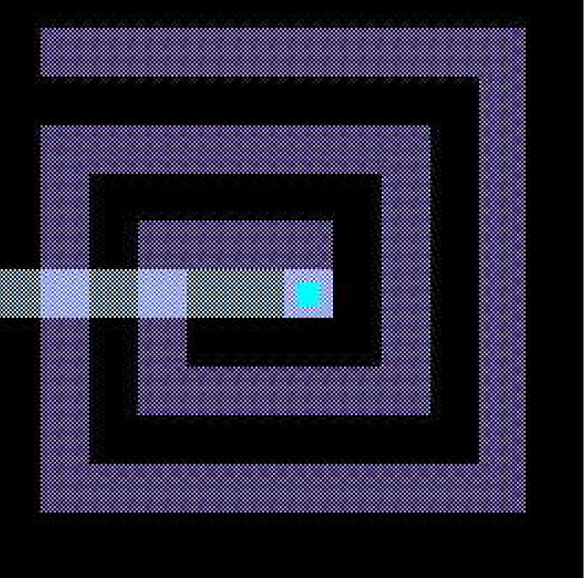

# Clock and Data Recovery PLL Design Considerations in 0.1 um CMOS

This post links to a paper that discusses clock and data recovery PLL design considerations in 0.1 um CMOS.

Link:  [Clock_and_Data_Recovery_PLL_Design_Considerations_in_0.1_um_CMOS.pdf](Clock_and_Data_Recovery_PLL_Design_Considerations_in_0.1_um_CMOS.pdf) 

###### References

This and other papers at [<u>https://www.researchgate.net/scientific-contributions/Z-Pfeffer-11999069</u>](https://www.researchgate.net/scientific-contributions/Z-Pfeffer-11999069)
