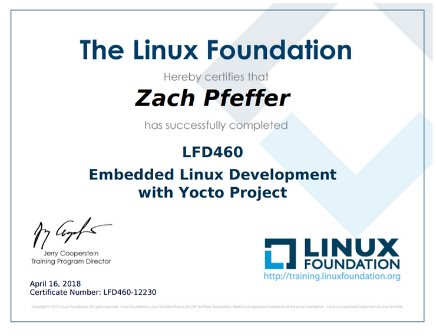

# Completed LFD460: Embedded Linux Development with Yocto Project

Yeah!

I highly recommend this course. Here's a [link](http://training.linuxfoundation.org/linux-courses/development-training/embedded-linux-development-with-yocto-project) to an upcoming session. My class was in beautiful [Austin, Texas](http://www.austintexas.org/) @ the [http://www.extellent.com/](http://www.extellent.com/) facilities.

I can't wait to take more of the great courses offered by the [Linux Foundation](http://www.linuxfoundation.org/)!

My certificate:

**Reference**

Austin card from [link](http://emralife.com/magazine/2016/11/08/austin-texas-keeping-it-weird/)

