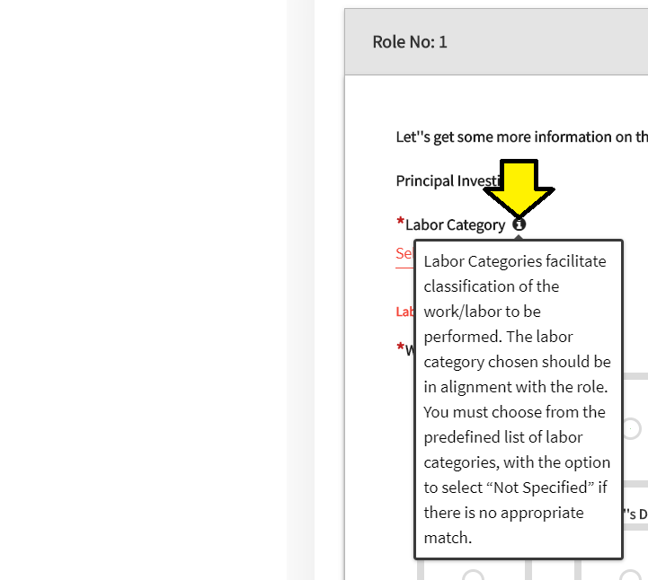
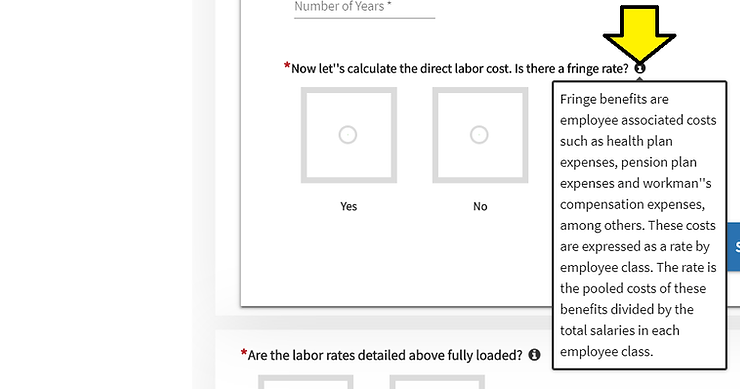
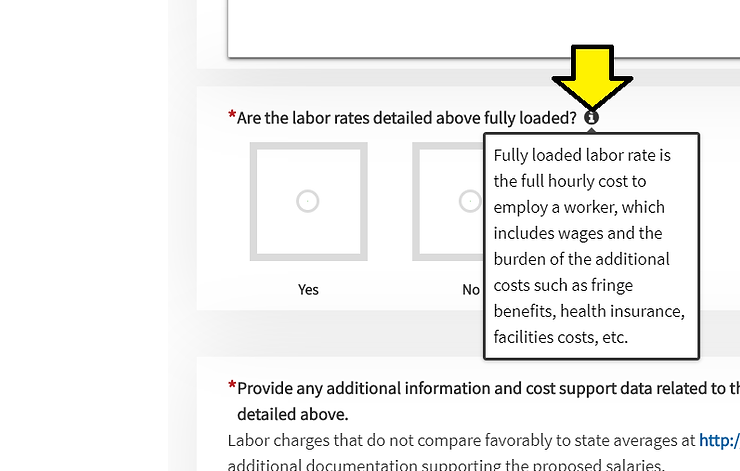
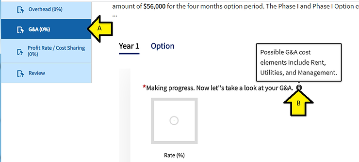
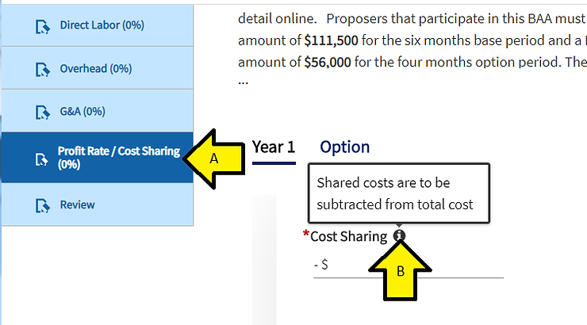

# Contents of DoD SBIR/STTR 20.1 Cost Volume Info Pop-Ups: Fringe Benefits, Fully Loaded Labor Rate, e

This post presents the contents of the "info pop-ups" on each page of the DoD SBIR/STTR 20.1 Vol III Cost Volume online form and the Labor Category Options available. I'm listing it because I could not find these without first getting into the form and I thought that other SBIR/STTR applicants that are putting their Cost Volumes together may like to see the "info pop-ups" and Labor Category Options outside the online form so that they can start their Cost Volumes outside their tool.

**Labor Categories**

"Labor Categories facilitate classification of the work/labor to be performed. The labor category chosen should be in alignment with the role. You must choose from the predefined list of labor categories, with the option to select "Not Specified" if there is no appropriate match."

**Labor Category Options**

Architectural and Engineering Manager

Aerospace Engineer

Biomedical Engineer

Chemical Engineer

Civil Engineer

Computer Hardware Engineer

Electrical Engineer

Electronics Engineer

Except Computer

Environmental Engineer

Industrial Engineer

Materials Engineer

Mechanical Engineer

Nuclear Engineer

Engineers, All Other

Aerospace Engineering and Operations Technician

Civil Engineering Technician

Electrical and Electronics Engineering Technician

Electro-Mechanical Technician

Environmental Engineering Technician

Industrial Engineering Technician

Mechanical Engineering Technician

Engineering Technicians

Engineering Technicians, Except Draftees, All Other

Chemical Technician

Nuclear Technician

Life, Physical, and Social Technician, All Other

Biochemists and Biophysicists

Microbiologist

Medical Scientist

Astronomer

Physicist

Atmospheric and Space Scientist

Chemist

Materials Scientist

Geoscientist

Physical Scientists, All Other

Life Scientists, All Other

Computer and Information Research Scientist

Computer Systems Analyst

Computer Programmer

Software Developer

Computer Occupations, All Other

Chief Executive

General and Operations Manager

Not Specified

**Fringe Benefits**

"Fringe benefits are employee associated costs such as health plan expenses, pension plan expenses and workman's compensation expenses, among others. These costs are expressed as a rate by employee class. The rate is the pooled costs of these benefits divided by the total salaries in each employee class."

**Fully Loaded Labor Rate**

"Fully loaded labor rate is the full hourly cost to employ a worker, which includes wages and the burden of the additional costs such a fringe benefits, health insurance", facilities costs, etc."

**G&A Costs**

"Possible G&A cost elements include Rent, Utilities, and Management"

**Shared Costs**

"Shared costs are to be subtracted from total cost"

**Profit Rate**

"Profit is to be added to total cost"

**Reference**

SBA Logo from [[link](http://www.sba.gov/brand/visual-identity/logo/)\]