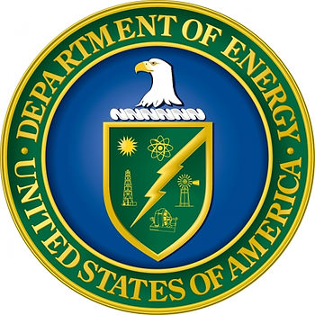

# DoE SBIR Letters of Support

This post is a short note on what Letters of Support for DoE SBIRs should contain. It also lists the great "doing bizdev" info from the site.

**Note**

The tutorial's web page takes a while to load.

**What Letters of Support Should Contain**

Here are 4 points from the tutorial:

-   "More commonly a letter of support is either an **endorsement for the work** OR **an offer to provide facilities or data**."
    
-   "Endorsements are helpful if they **come from well-known people in the field** – i.e. an industry expert who can attest to the significance of the problem and/or the potential value of the approach proposed by the small business."
    
-   **"Another type of support** that an organization can provide is **the use of their facilities at no cost for either the company or a third party to conduct a test**."
    
-   **"Related support** is the **provision of a data set** or a **coupon that can be used for testing**."
    

**Where this Info Comes From**

In FY 2019 PHASE I RELEASE 2 FUNDING OPPORTUNITY ANNOUNCEMENT (FOA) NUMBER: DE-FOA-0001941 at [[link](http://science.energy.gov/~/media/grants/pdf/foas/2019/SC_FOA_0001941.pdf)] the The DoE lists:

The specific tutorial is:

DOE SBIR/STTR Phase 1 Proposal Prep Tutorial [[#17](https://pfefferz.wixsite.com/website/home/hashtags/17)] Securing Letters of Support at [[link to pdf](http://www.doesbirlearning.com/wp-content/themes/phase0-LMS/images/public/Module17.pdf)\] [[link to page](http://www.doesbirlearning.com/module-17-17/)] is the specific tutorial.

**Great Write up On Doing Bizdev**

The tutorial also has a **great** write up on how to do business development:

The approach to industry would be different and more circumspect. It would be wise to consider reaching out to industry as a step in the process of developing a relationship with a potential licensee or partner. If possible in anticipation of submitting an SBIR or STTR proposal in the future, we would recommend attending conferences where companies in which you have a potential interest are making presentations. Listen to their presentations and then follow up at the conference with questions or contact them afterwards and begin to develop a relationship. Building on the battery separator application, we entered the company name Celgard and the word “conference” into the Google search bar. This yielded Celgard’s events calendar with a link to an upcoming conference in Florida. If possible, using this type of strategy seek out key conferences and plan to attend. Your mission in attending the conference is to listen to the presenters, learn what they are doing, and assess if you may wish to reach out to them in the future. As it is unlikely that you would find a conference to attend while the DOE Funding Opportunity Announcement is open, this approach is part of a longer term strategy. If you find a person’s work to be of particular interest, after their presentation introduce yourself, and provide them with a copy of your business card. In the future, you can then follow up with them by e-mail. The sample e-mail provided could be easily modified for this application.

**References**

DoE seal from [[link](http://www.energy.gov/management/office-management/operational-management/history/brief-history-department-energy)]

