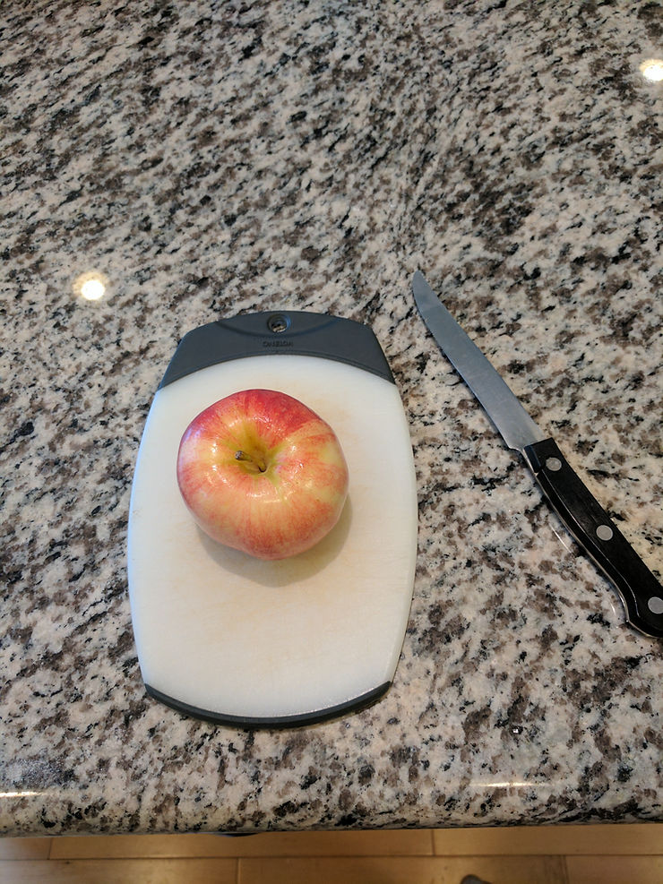
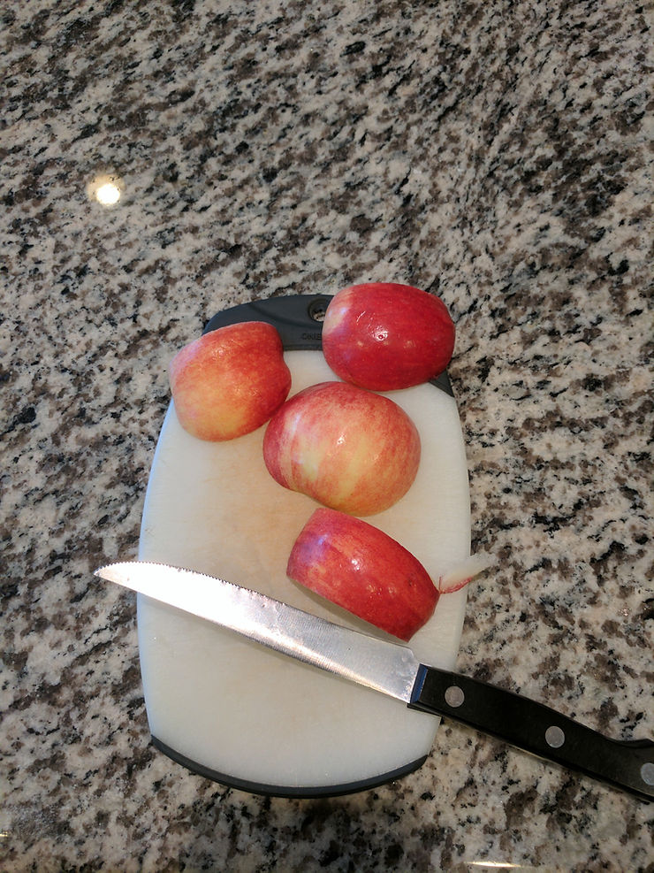
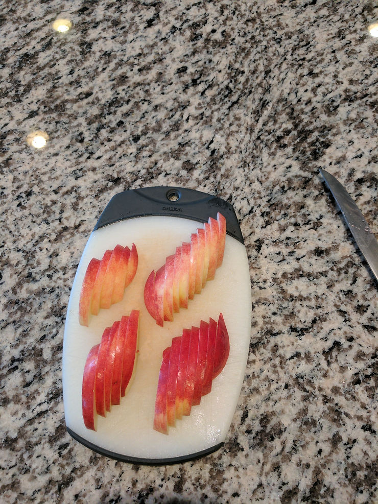
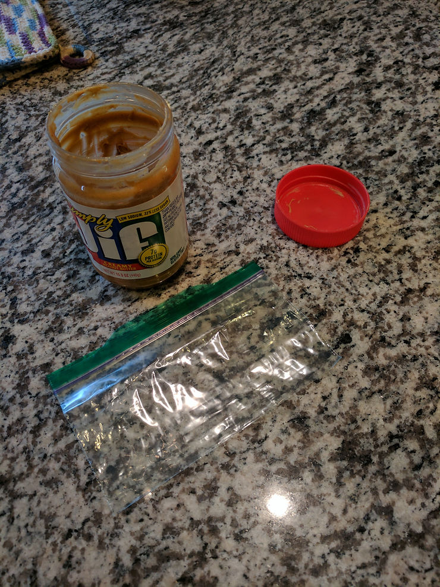
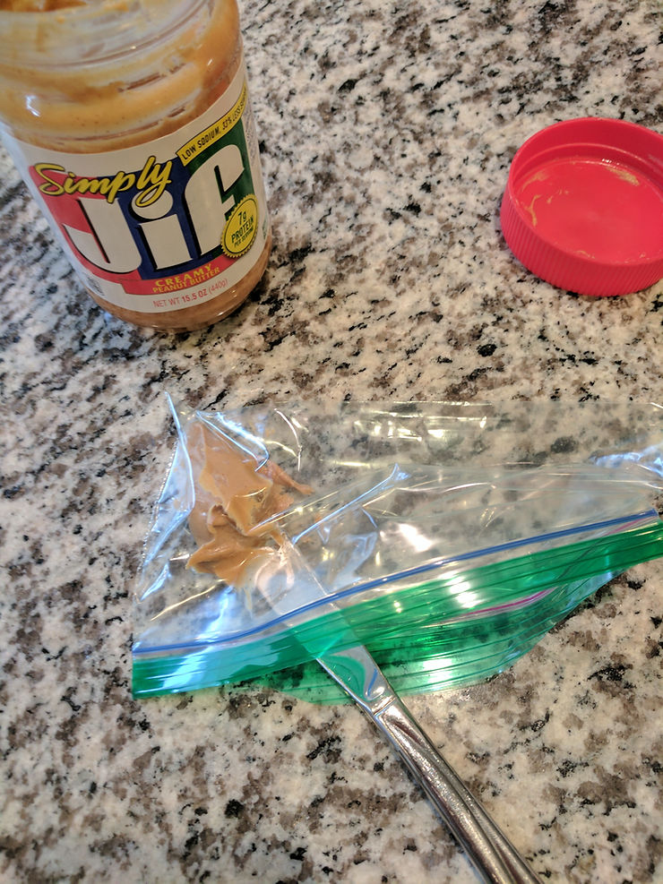
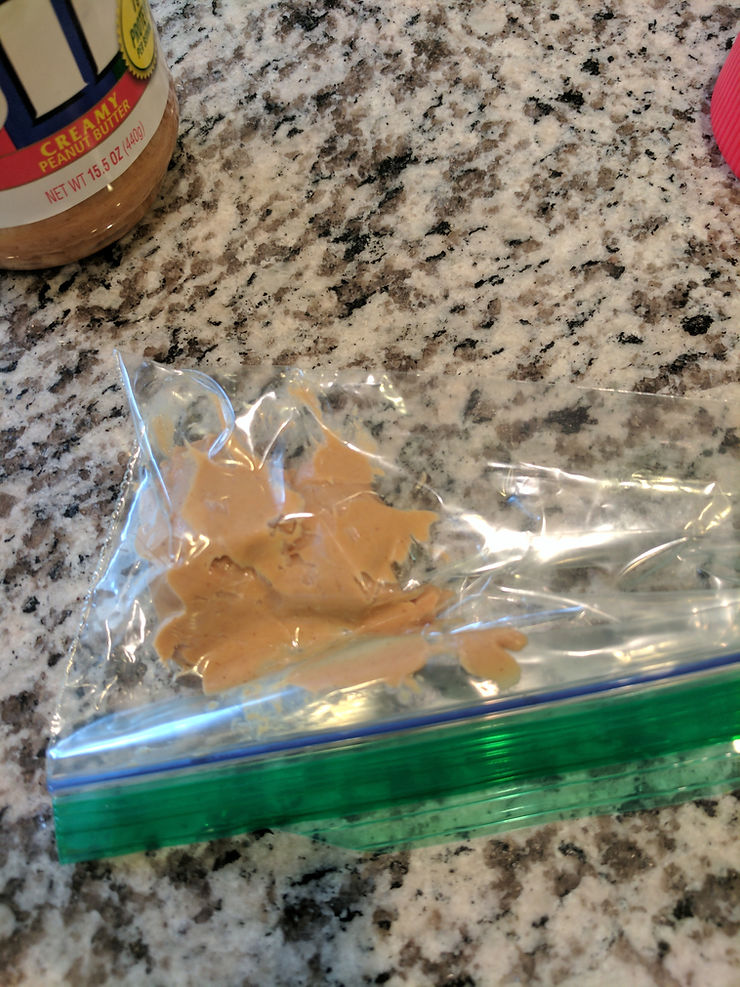
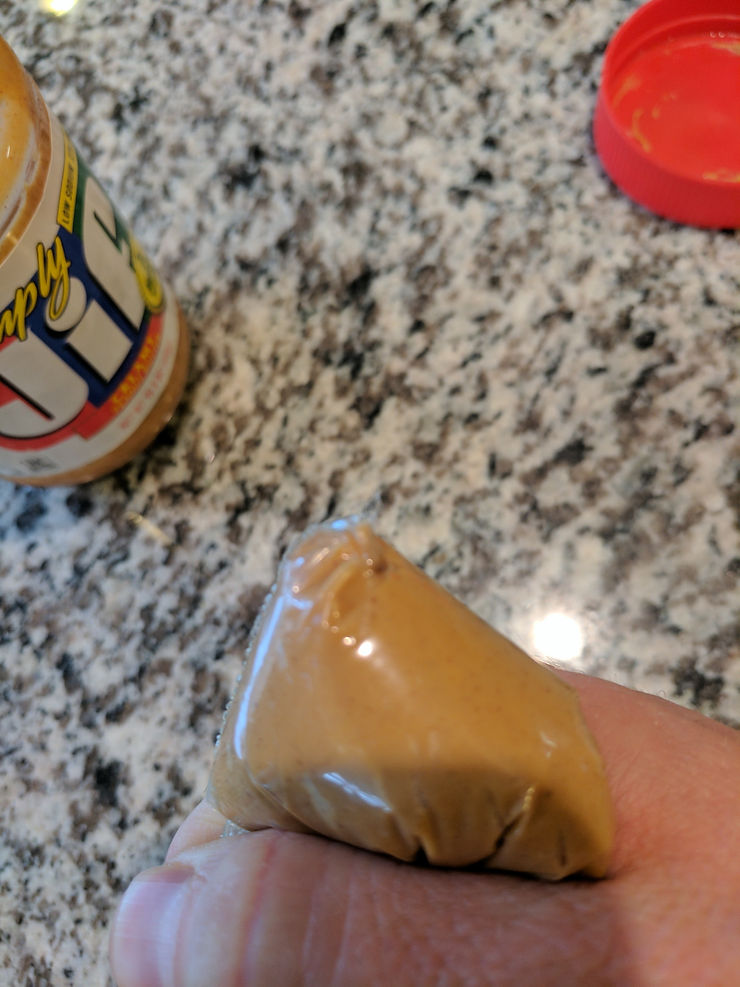
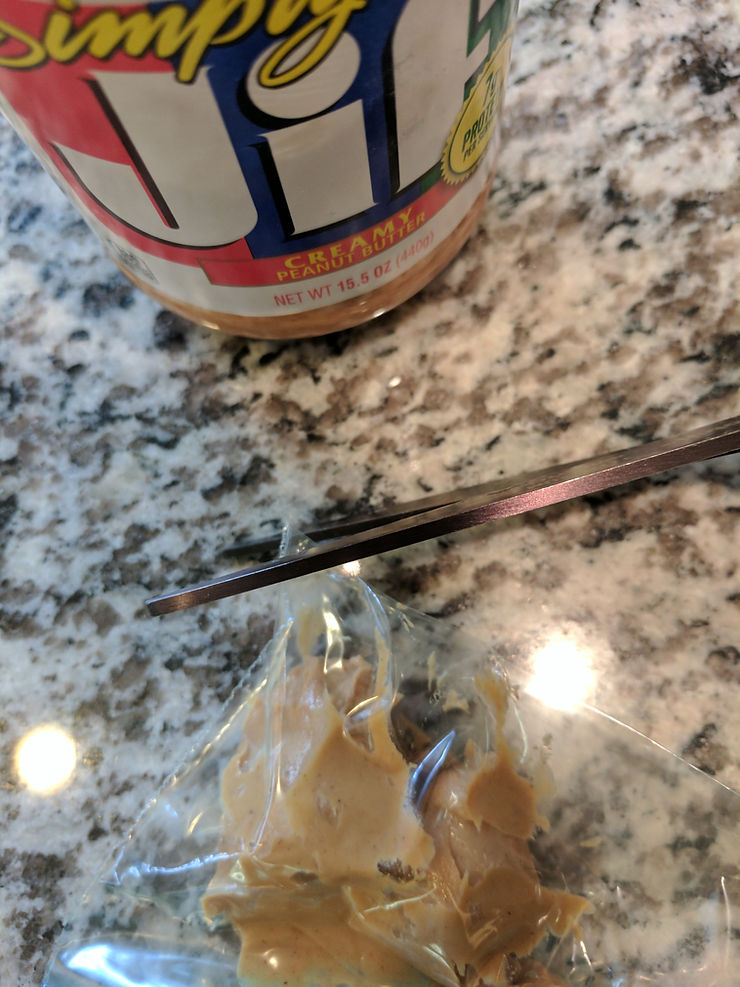
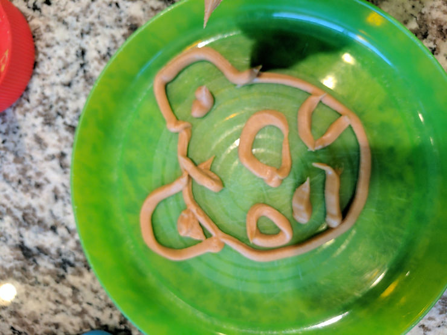
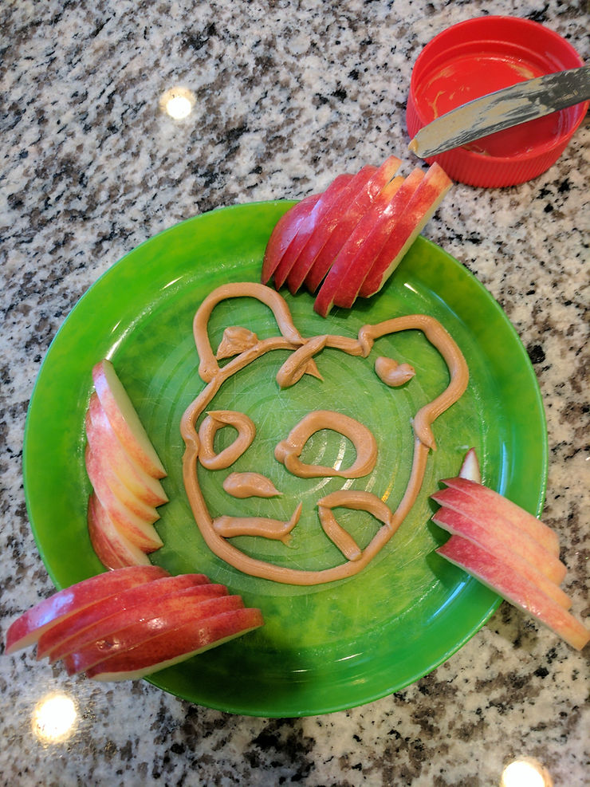

# Fancy Peanut Butter and Apples

Make peanut butter and apples fancy like Fancy Nancy:

These (mostly) kid friendly instructions demonstrate how to make peanut butter and apples fancy by slicing the apples thinly and piping a picture on the plate.

What you'll need:

-   An apple
    
-   A sharp knife (for the grown-ups)
    
-   A butter knife
    
-   A cutting board
    
-   A plate
    
-   [Creamy JIF peanut butter](http://www.amazon.com/JIF-Peanut-Butter-Creamy-Pack/dp/B001KU2TZI)
    
-   A [Ziplock snack bag](http://www.amazon.com/Ziploc-5126083-Snack-Bags/dp/B00MR1TK4C/ref=sr_1_5_a_it?ie=UTF8&qid=1488806850&sr=8-5&keywords=ziploc%2Bplastic%2Bbags&th=1)
    
-   Scissors
    

## Steps

**1.** Get the apple, scissors and the cutting board.

**2.** Cut the apple in four pieces.

**3.** Cut each piece into very thin slices.

**4.** Set the apples aside. Get out the peanut butter, Ziplock bag and butter knife (the butter knife failed to make the shot).

**5.** Use the knife to get some peanut butter and put the peanut butter into the corner of the Ziplock bag.

It should look like this:

**6.** Squeeze the peanut butter into the corner of the Ziplock bag with your hand.

**7.** Cut the corner of the Ziplock bag with the scissors. Don't cut too much.

**8.** Get the plate. Now squeeze the peanut butter slowly out of the bag to draw a fancy picture! This is Daniel Tiger:

Actual Daniel Tiger:

**9.** Finish your fancy apples by arraying the thin apple slices. Bon Appétit!

