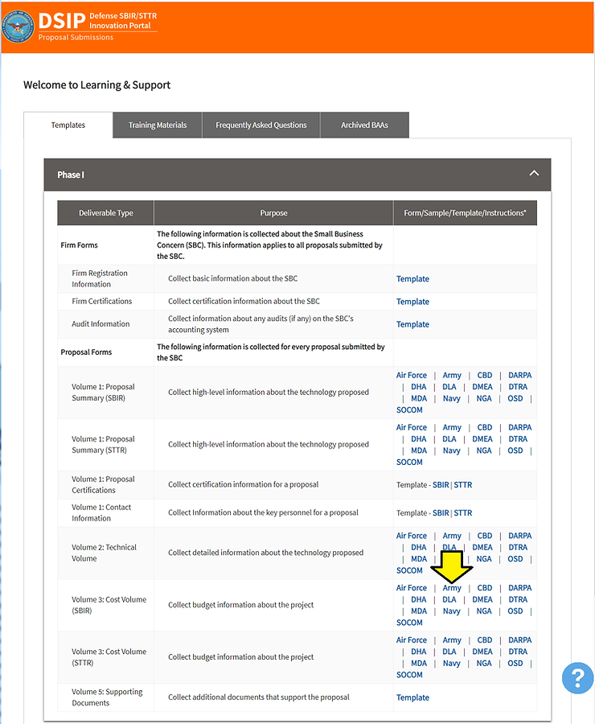
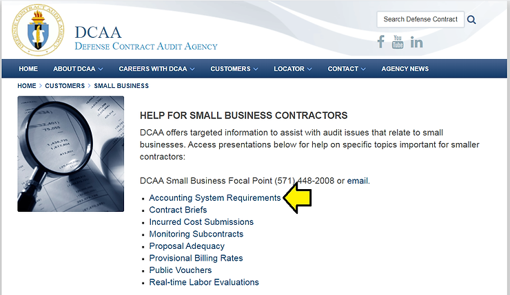

# Finding Resources for Learning about Fringe, Overhead and General Management and Administration (G&a

This post lists some resources I've found while learning about fringe rate, overhead and general management and administration rate (G&A rate) cost allocation for Army SBIR proposals.

**Finding what Fringe, Overhead and General Management and Administration (G&A) mean to the Army**

As of Feb 8th 2020, the DoD posts Learning and Support templates to \[linklink\] which includes a template for putting together the _Cost Volume_ for each "component," including the Army [saved:[sbir\_p1\_Army\_cost\_volume\_template.pdf](http://drive.google.com/file/d/1rJ482yYCzjWKidQe9eH3QlI3rgY8tVZR/view?usp=sharing)\].

Within the template it asks for direct and indirect costs. Within the indirect costs it asks for **fringe**, **overhead** and general management and accounting (**G&A**).

The DoD lists SBIR/STTR Training & Advocacy resource at [[link](http://training.defensebusiness.org/dod-resources)\] includes various info including:

_Defense Federal Acquisition Regulation Supplement (DFARS) [__link__\]_

_A supplement to the FAR that provides DoD-specific acquisition regulations that DoD government acquisition officials – and those contractors doing business with DoD – must follow in the procurement process for goods and services._

On the DCAA's page, scroll down to find a link to SMALL BUSINESS:

The **SMALL BUSINESS** link takes you to [link] which list a to a presentation called **Accounting System Requirements** [link][saved:[Accounting_System.pdf]([accounting_System.pdf](accounting_System.pdf))]:

Within **Accounting System Requirements** it lists **SF1408** [[link]((SF1408-14b.pdf))]. This is the **checklist** that is listed in DOD-20.1-v15-1.pdf [link]([DOD-20.1-v15-1.pdf](DOD-20.1-v15-1.pdf))]: 

_4.20 Adequate Accounting System (page 18)_

_In order to reduce risk to the small business and avoid potential contracting delays, it is suggested that companies interested in pursuing Phase II SBIR contracts and other contracts of similar size with the Department of Defense (DoD), have an adequate accounting system per General Accepted Accounting Principles (GAAP), Generally Accepted Government Auditing Standards (GAGAS), Federal Acquisition Regulation (FAR) and Cost Accounting Standards (CAS) in place. The accounting system will be audited by the_ **_Defense Contract Audit Agency_** _(DCAA). DCAA’s requirements and standards are available on their Website at:_ _http://www.dcaa.mil_ _and click on “Guidance” and then click on “Audit Process Overview – Information for Contractors,” and also at: http://www.dcaa.mil and click on_ **_“Checklists and Tools” and then click on “Pre-award Accounting System Adequacy Checklist.”_**

At [link] a **Pre-award Accounting System Adequacy Checklist** is posted [link][saved:[Preaward_Survey_of_Prospective_Contractor_Accounting_System_Checklist_updated10_9_19.pdf]([Preaward_Survey_of_Prospective_Contractor_Accounting_System_Checklist_updated10_9_19.pdf](Preaward_Survey_of_Prospective_Contractor_Accounting_System_Checklist_updated10_9_19.pdf))]. This document helps you prepare to pass SF1408.

Also within **Accounting System Requirements** it lists:

**DFARS 252.242-7006(c)(2)** requires proper segregation of direct costs from indirect costs.

\* **Direct Cost** is any cost that is identified specifically with a particular final cost objective.

\* **Indirect cost** means any cost not directly identified with a single, final cost objective, but identified with two or more final cost objectives or an intermediate cost objective

...and:

**DFARS 252.242-7006(c)(3)** requires identification and accumulation of direct costs by contract.

\* Direct costs are not limited to items that are incorporated in the end product as material or labor. 

\* No final cost objective shall have allocated to it as a direct cost any cost that has been included in an indirect cost pool. 

\* Direct costs of the contract shall be charged directly to the contract.

...and:

**Direct Cost** **DFARS 252.242-7006(c)(3)** requires identification and accumulation of direct costs by contract. \* Direct costs are not limited to items that are incorporated in the end product as material or labor. \* No final cost objective shall have allocated to it as a direct cost any cost that has been included in an indirect cost pool. \* Direct costs of the contract shall be charged directly to the contract.

...and:

**Indirect Cost**

\* Again, indirect cost means any cost not directly identified with a single, final cost objective, but identified with two or more final cost objectives or an intermediate cost objective.

\* An indirect cost is not to be allocated to a final cost objective if other costs incurred for the same purpose in like circumstances have been included as a direct cost of any other final cost objective.

...and:

**General and Administrative (G&A)**

These are management, financial, and other expenses related to the general management and administration of the business unit as a whole. To be considered a G&A expense of a business unit, the expenditure must be incurred by, or allocated to, the general business unit.

Examples of G&A expenses include: 

\* Salary and other costs of the executive staff of the corporate or home office 

\* Salary and other costs of such staff services as legal, accounting, public relations, and financial offices 

\* Selling and marketing expenses

**Reference**

SBA Logo from [[link](http://www.sba.gov/brand/visual-identity/logo/)\]