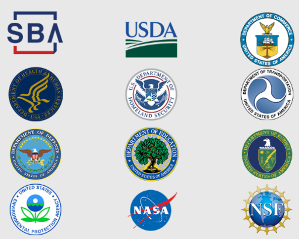
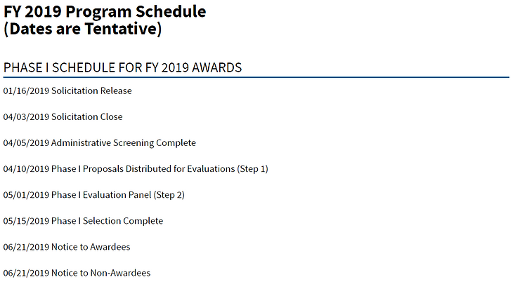
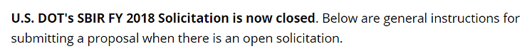
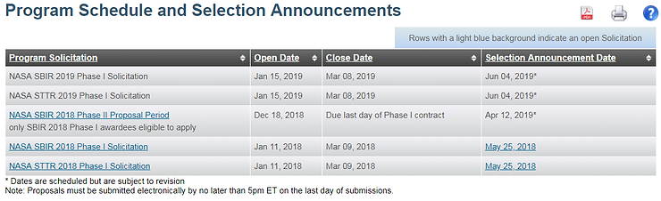
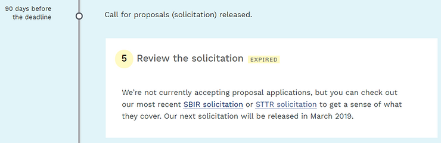

# FY2019 Phase I SBIR/STTR Dates

This post is a snapshot of all the links to Phase I SBIR/STTR solicitations as of Jan 11th 2019. The information presented may be out of date. The numbers in (**num**) are all the awards under that program as of today.

**Department of Agriculture** (3297) [[link](http://nifa.usda.gov/phase-i-phase-ii-solicitations)\] Typically Opens in June

-   National Institute of Food and Agriculture filter National Institute of Food and Agriculture (0)
    

**Department of Commerce** (1460)

-   **National Institute of Standards and Technology** (337) [SBIR [link](http://www.nist.gov/tpo/small-business-innovation-research-program)\] [[schedule](http://www.nist.gov/tpo/resources/sbir-schedule)\] Opens Jan 2019

-   **National Oceanic and Atmospheric Administration** (115) [SBIR [link](http://techpartnerships.noaa.gov/SBIR.aspx)\]

**Nothing listed due to government shutdown**

**Department of Defense** (79846) [link\] Still Time

-   Air Force (24054)
    
-   Army (16001)
    
-   Defense Advanced Research Projects Agency (5861)
    
-   Defense Health Program (632)
    
-   Defense Logistics Agency (157)
    
-   Defense Microelectronics Activity (49)
    
-   Defense Threat Reduction Agency (835)
    
-   Missile Defense Agency (8015)
    
-   National Geospatial-Intelligence Agency (63)
    
-   Navy (21916)
    
-   Office for Chemical and Biological Defense (590)
    
-   Office of the Secretary of Defense (679)
    
-   Special Operations Command (706)
    

**Department of Education** (1272) [[link](http://ies.ed.gov/sbir/solicitations.asp)\] Opens Jan 2019

-   Institute of Education Sciences (41)
    

**Department of Energy** (12588) [[link](http://science.energy.gov/~/media/sbir/pdf/TechnicalTopics/FY2019_Phase_I_Release_2_Topics.pdf)\] Still Time

-   ARPA-E (84)
    

**Department of Health and Human Services** (38821) at [[link](http://sbir.nih.gov/funding)\] Closed

-   National Institutes of Health (3097)
    

**Department of Homeland Security** (993) [[link](http://sbir2.st.dhs.gov/portal/SBIR/)\] Still Time

-   Domestic Nuclear Detection Office (0)
    
-   Domestic Nuclear Detection Office SBIR Program (0)
    
-   Science and Technology Directorate (0)
    

**Department of the Interior** (15) [**need link**\]

**Department of Transportation** (1091) [[link](http://www.volpe.dot.gov/work-with-us/small-business-innovation-research/solicitations)\] Closed

**Environmental Protection Agency** (1796) [[link](http://www.epa.gov/sbir/sbir-funding-opportunities)\] Closed

**National Aeronautics and Space Administration** (15506) [[link](http://sbir.nasa.gov/)\] [[schedule](http://sbir.nasa.gov/prgschedanncmnt)\] Still Time

**National Science Foundation** (12450) [[link](http://seedfund.nsf.gov/)\] Opens March 2019

Nuclear Regulatory Commission (168) [[some info](http://www.nrc.gov/about-nrc/contracting/small-business/programs.html#small)\]

Small Business Administration (0)

**References**

-   All awards at [[link](http://www.sbir.gov/sbirsearch/award/all)\]
    
-   SBIR site at [[link](http://www.sbir.gov/)\]
    
-   [grants.gov](http://www.grants.gov/learn-grants/grant-making-agencies/department-of-the-interior.html)
    
-   Open SBIRs at [[link](http://www.sbir.gov/solicitation-listing/open)\]