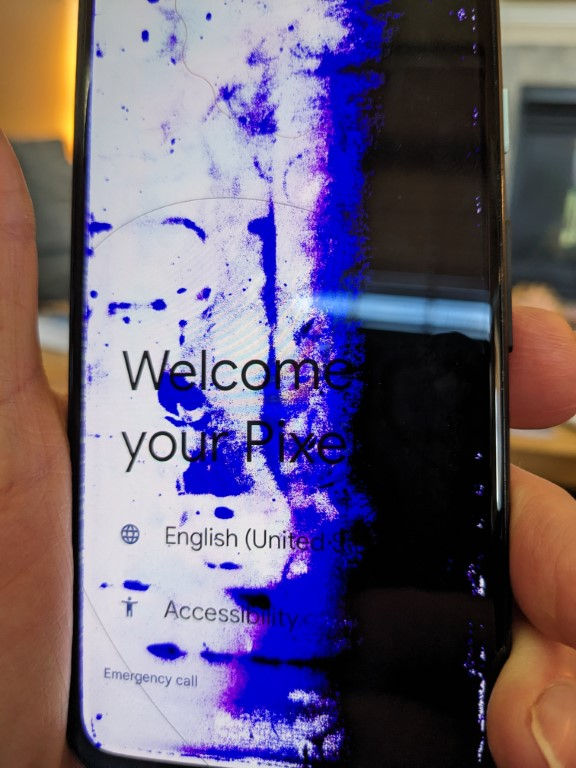
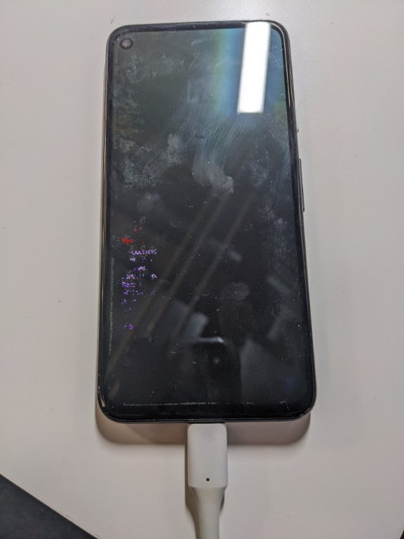

# Use fastboot to Get the Serial Number of a Pixel 4a Windows 10

The post shows how to use fastboot to get the serial number of a Pixel 4a on Windows 10. You may need this to determine whether a phone is under warranty and the screen is dead or dying.

## A Nearly Dead Pixel 4a Screen

## You'll Need

A USB-C to USB-A cable.

## <u>Use fastboot to Get the Serial Number of a Pixel 4a Windows 10</u>

## Plug the Phone In

Plug the phone into the USB-C end of the cable and the USB A end into the computer.

Press Down Volume and Power to get into fastboot.

## Get the Driver

Download usb\_driver\_r13-windows.zip from:

https://developer.android.com/studio/run/win-usb

...or cached:

  [usb_driver_r13-windows.zip](usb_driver_r13-windows.zip) 

...to the Downloads directory and **extract it**

## Get fastboot

Download commandlinetools-win-11076708\_latest.zip from:

https://developer.android.com/studio

...or cached:

 [commandlinetools-win-11076708_latest.zip](commandlinetools-win-11076708_latest.zip) 

...to the Downloads directory and **extract it**

## Open the Device Manager

Type **Windows + R**

Type **devmgmt.msc**

Find the USB device with the exclamation

Right-click on the device and select install driver

## Make Sure You're in Fastboot

Make sure the phones plugged in and the USB driver is installed

Simultaneously press and hold the Down Volume button and the Power button for 30 secs

Simultaneously release the Down Volume button and the Power button

## Run fastboot from the Command Line

Type **Windows + R**

Type cmd

Change directory where fastboot.exe is

In cmd cd "DIR"

fastboot.exe devices

## The Serial Number via fastboot

You should see (XXXXXXXXXXXXXX is the 14 character serial number):

XXXXXXXXXXXXXX fastboot