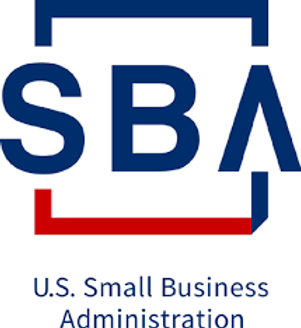

# "Guidance for Completing the Company Commercialization Metrics Survey" from NASA 2020 SBIR

This text is from NASA's "Company Commercialization Metrics Survey" more info "pop-up." I'm posting it because I thought it may be good to reference in the future, if and when, the company I created wins and commercializes the technology we build.

##### **Instructions**

For each SBIR and STTR Phase II received to date from NASA, provide current and accurate commercialization -sales and/or additional investment -resulting from, extending, or logically concluding the Phase II project.

-   Create a record for every Phase II project awarded not already listed on the Report (this step should be done in the Prior Awards Addendum). Be sure to provide the complete topic number and contract/grant number for each Phase II award. (If lost or forgotten, try searching for awards on the NASA SBIR/STTR website (http://sbir.nasa.gov), or SBA's TechNet database at http://tech-net.sba.gov/tech-net/dsp\_search.cfm.)
    
-   For Phase II projects already entered on the Company Commercialization Report, update sales, investment and other Phase III information with the most recent information.
    
-   Information about your firm's commercialization efforts not fully captured by sales and investment figures should be explained in the narrative section.
    
-   Be sure to update the point of contact information for the person responsible for the upkeep and validity of your firm's commercialization information, if it has changed.
    

##### **Do's and Don'ts**

1.  Do not include Phase I or Phase II SBIR/STTR awards in sales or investment.
    
2.  Do not count the same item as both "sales" and "additional investment".
    
3.  Additional R&D services should be recorded as additional investment, not sales.
    
4.  If two or more Phase II projects contributed to a single new product that has generated sales revenue and/or additional investment, apportion the sales and investment among the contributing projects without double-counting. Example: Phase II projects A and B lead to a new software product that has generated sales of $10 million to the Army and $12 million to retail software stores. For both projects A and B, enter $5 million for sales to DoD and $6 million for sales to the private sector.
    
5.  Count only actual sales and investment dollars received to date, and not projected sales and investment. For sales to or investment by the government, count only the amount of government funding that has been obligated to date and not the total award amount.
    
6.  Outside (non-SBIR/STTR) funding received through the Fast Track and/or Phase II Plus/Enhancement programs should be reported as additional investment, but do not include SBIR matching funds.
    
7.  For purposes of this report, your "firm" includes all affiliates. (reference 13CFR121.103)
    
8.  Only report sales and investment figures on Phase II awards received by your firm. In the case of novation or company acquisition, do not count commercialization accrued to the original firm prior to the novation or \\acquisition, and explain these special circumstances in the narrative.
    

##### **Definitions**

Sales:

Includes cash revenue from the sale of new products or non-R&D services embodying the specific technology developed under this Phase II project.

-   Count only such revenue accruing to your firm and not to other entities. If your firm sold or licensed the technological know-how developed under Phase II to another entity, enter the cash revenue accruing to the other entity from its sale of new products or non-R&D services embodying the Phase II technology in the "3rd Party Revenue" field, not with your firm's sales figures.
    
-   If the new product/service embodying the Phase II technology is a component of a larger product/service (e.g., an improved coating on an existing optical lens product), count only the sales attributable to the component rather than the larger product/service.
    

"Sales" does not include:

-   SBIR/STTR contracts or grants (Phase I or II), or revenue from any other R&D activities, including follow-on R&D contracts or grants. "R&D activities" include any activities directed toward reducing the technical risk of the technology.
    
-   Revenue from your firm's sales to an affiliate of your firm. (13CFR121.103)
    

"3rd Party Revenue" (if known):

Includes cash revenues received by an entity other than this SBIR/STTR firm from the sale of new products or non-R&D services derived from the specific technology developed under this Phase II project, for example through a license agreement or spin-off. Only count the portion of 3rd Party Revenues that accounts for the SBIR/STTR technology's share of the total product or service. Example: If a new coating for helicopter blades developed under a SBIR/STTR Phase II project is used by a 3rd Party Manufacturer, count only the 3rd Party revenues attributed to the blade coating, not the entire helicopter.

"Additional Investment":

Includes investment by any source other than the federal SBIR/STTR program in activities that further the development and/or commercialization of the specific technology developed under the Phase II project. Examples of such activities include:

-   Additional R&D on the Phase II technology
    
-   Manufacturing/production start-up
    
-   Purchase of plant and equipment for manufacturing/production
    
-   Protection of intellectual property
    
-   Obtaining certifications
    
-   Marketing start-up and marketing
    
-   Training of workforce to manufacture or sell new products embodying the Phase II technology.
    

These may be activities funded and conducted by your firm or by other entities.

"Manufacturing-related R&D":

Encompasses improvements in existing methods or processes, or wholly new processes, machines or systems in one of the following areas:

-   Unit process level technologies that create or improve manufacturing processes, including fundamental improvements in existing manufacturing processes that deliver substantial productivity, quality, or environmental benefits; and/or development of new manufacturing processes, including new materials, coatings, methods, and practices associated with these processes.
    
-   Machine level technologies that create or improve manufacturing equipment, including improvements in capital equipment that create increased capability (such as accuracy or repeatability), increased capacity (through productivity improvements or cost reduction),or increased environmental efficiency (safety, energy efficiency, environmental impact); and/or new apparatus and equipment for manufacturing, including additive and subtractive manufacturing, deformation and molding, assembly and test, semiconductor fabrication, and nanotechnology.
    
-   Systems level technologies for innovation in the manufacturing enterprise, including advances in controls, sensors, networks, and other information technologies that improve the quality and productivity of manufacturing cells, lines, systems, and facilities; and/or innovation in extended enterprise functions critical to manufacturing, such as quality systems, resource management, supply chain integration, and distribution, scheduling and tracking; and/or technologies that enable integrated and collaborative product and process development, including computer-aided and expert systems for design, tolerancing, process and materials selection, life-cycle cost estimation, rapid prototyping, and tooling.
    
-   Environment or societal level technologies that improve workforce abilities and manufacturing competitiveness, including technologies for improved workforce health and safety, such as human factors and ergonomics; and/or technologies that aid and improve workforce manufacturing skill sand technical excellence, such as educational systems incorporating improved manufacturing knowledge and instructional methods.
    

"Cost Savings/Cost Avoidance":

A decrease in elements of cost between the status quo and the alternative that resulted from the SBIR/STTR technology derived from this Phase II award. Cost savings are a quantifiable benefit demonstrated by: (a) a reduction or avoidance of actual costs by a user or (b) by measurable efficiencies in labor or supply utilization as a result of a change in operations. Examples are:

-   Prior to the SBIR/STTR technology, the program required the purchase of certain hardware, but the implementation of the product/service derived from the Phase II technology does not require the purchase of the hardware and does not degrade current capability. The cost of the hardware x the number of hardware items purchased per year = $ cost avoidance.
    
-   Company ABC paid $100 per widget. By reducing the numbers of parts, the price is reduced to $70 per widget. The cost savings is computed by the number of widget consumed each year: $30/widget x widgets/year = $ cost reduction/year.
    
-   A procedure requires 30 minutes to complete. By using the new technology completion time has been reduced to five minutes. The 25-minute savings would be multiplied by the total number of procedures completed within each year. This figure is converted to hours to represent the total hours saved each year and multiplied by the full cost salary rate of those completing the procedure to calculate the total cost savings: 25 minutes saved/procedure x procedures completed/year divided by minutes/hours = hours saved/year: hours saved/year x fully costed salary = $ cost reduction/year.
    

**References**

-   Text from [[link](http://sbir.gsfc.nasa.gov/)\]
    
-   SBA Logo from [[link](http://www.sba.gov/brand/visual-identity/logo/)\]