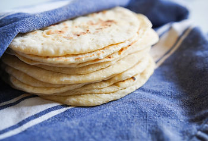

# How I Make Tortillas

This post describes how I make tortillas. This recipe was originally from **Mi Abuelita Elvira Gonzalez Leal** at approximately this [[link](http://www.texasrollingpins.com/flour-tortilla-recipe)\]. I learned this from my beautiful wife who taught me so that I could help ;)

**Equipment**

Flat cast iron pan

Big mixing bowl

Vinyl food prep gloves

Rolling pin

Towels or a tortilla warmer

Spatula

Wax paper

**Ingredients**

3 cups unbleached flour

2 tsp baking powder

1 tsp salt

4 tbsp vegetable oil

3/4 cups warm water (may need more depending on where you live)

**Recipe**

1\. Mix the dry ingredients in a large bowl with a whisk

2\. Add oil

3\. Put on a pair of vinyl food prep gloves

4\. Work the oil into the flour, salt and baking powder until it sorta sticks together when you squeeze it together

Note: To me it feels kinda like Moon Sand aka Kinetic Sand [[link](http://www.target.com/p/kinetic-sand-sandbox-molds-colors-may-vary/-/A-16594254?sid=2197S&ref=tgt_adv_XS000000&AFID=google_pla_df&CPNG=PLA_Toys+Shopping_Local&adgroup=SC_Toys&LID=700000001170770pgs&network=g&device=c&location=1014452&gclid=Cj0KCQjw6MHdBRCtARIsAEigMxEAG_m9DSSAcHhjzWTUlsbdkXkDNM-BhhwpBU_iJkOXjDM6sctLxygaAmiBEALw_wcB&gclsrc=aw.ds)\]

5\. Add a little warm water (120 deg's ish) and work the oil/flour mixture in. Keep adding water a little at a time and working it in until you've built a ball of dough that's just shy of sticky. Add a little more flour if its too sticky.

Note: I know its right if I can roll it out without needing extra flour. Also, I think this is the crucial step and is what my wife taught me.

6\. Knead the dough for a minute or two

7\. Pull off about 12 little balls from the dough

8\. Set the cast iron to just shy of medium on the stove top

9\. Get out wax paper and roll out the balls with a rolling pin

10\. Once the cast iron is hot, put a rolled out dough ball on it and cook it for a minute or too. Flip it once and cook it for another minute or too.

Note: I look for browned patches to know when a side is done

11\. Once the tortilla is done, put the tortilla in a tortilla warmer or into a towel to keep it warm

...or so that my son has an easy place to find them and eat them all before they get to the table ;)

**Reference**

Tortilla picture from [[link](http://thepioneerwoman.com/food-and-friends/how-to-make-tortillas/)\].