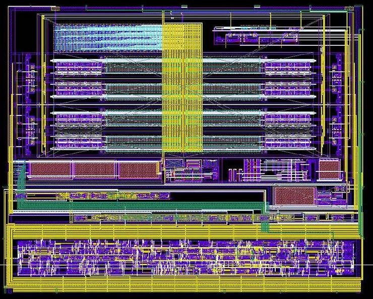

# Implementing a 5-bit Folding and Interpolating Analog to Digital Converter

This post links to a paper presenting the physical design of a 5-bit folding and interpolating analog-to-digital converter.

Link:  [Implementing_a_5-bit_Folding_and_Interpolating_Analog_to_Digital_Converter.pdf](Implementing_a_5-bit_Folding_and_Interpolating_Analog_to_Digital_Converter.pdf) 

###### References

This and other papers also available at https://www.researchgate.net/scientific-contributions/Z-Pfeffer-11999069.
