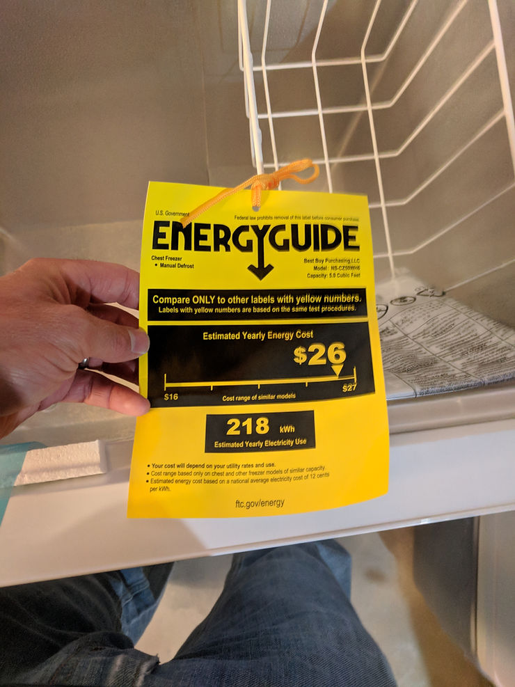

# Insignia - 5.0 Cu. Ft. Chest Freezer - White, Unboxing and Experience After 2 Months

This post shows an unboxing of the Model: NS-CZ50WH6 Insignia. It also shows the manual and how I leveled the unit.

Buy at BestBuy for 149.99 at [[link](http://www.insigniaproducts.com/pdp/NS-CZ50WH6/8390036)\].

**Experience**

I've had the freezer for 2 months and its been working great. With the knob midway between Max and Min the freezer reads 0 deg F on a thermometer I have inside it. I keep the knob a little past the midway point to keep it below 0 deg F.

**Unboxing**

**The Manual**

**Leveling It (as suggested in the manual)**

**Reference**

Shot of the freezer from BestBuy at [[link](http://www.insigniaproducts.com/pdp/NS-CZ50WH6/8390036)\].