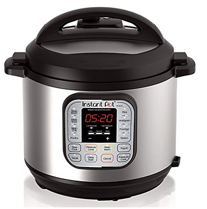

# InstaPot Pinto Bean Recipe

This post lists an "Instapot" recipe for pinto beans that has worked for me.

**Instapot Used**

Instant Pot Programmable Pressure Cooker Model: IP-DUO60 V3 [[Amazon](http://www.amazon.com/Instant-Pot-Multi-Use-Programmable-Pressure/dp/B00FLYWNYQ)\]

**Preparation Time**

5 min

**Cooking Time**

About 2 hours (45 to cook, 1 hour to sit)

**Ingredients**

2 cups of dry pinto beans (1 lb)

7 cups of water

1/2 tsp of salt

1 tbsp of vegetable oil

1/4 yellow onion

**Steps**

1\. Rinse the beans in cold water.

I put them in a strainer and run the strainer under cold tap water.

2\. Put everything in the Instapot.

3\. Stir with spoon.

4\. Set the Instapot to 45 min on high.

5\. Once done, let the Instapot cool for an hour.

6\. Remove from the Instapot, drain and eat or save some of the water, mash up the beans and eat.

Enjoy!

**Reference**

InstaPot image from [[link](http://www.amazon.com/Instant-Pot-Multi-Use-Programmable-Pressure/dp/B00FLYWNYQ)\]