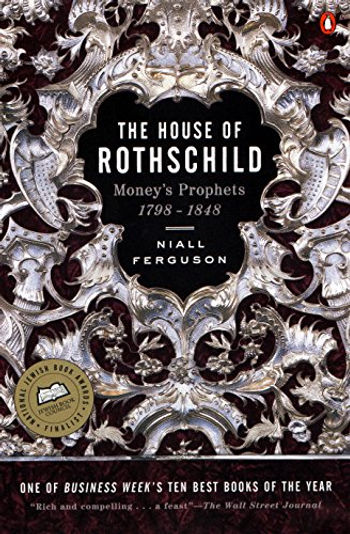

# Large Families of Nineteenth- and Early-Twentieth-Century Fiction

This posts lists examples of large families of nineteenth- and early-twentieth-century fiction presented by Niall Feruson in The House of Rothschild: Money's Prophets, 1798-1848.

**List**

Thackeray's Newcomes [[link](http://en.wikipedia.org/wiki/The_Newcomes)\]

Trollope's Pallisers [[link](http://en.wikipedia.org/wiki/Palliser_novels)\]

Galsworthy's Forsytes [[link](http://en.wikipedia.org/wiki/The_Forsyte_Saga)\]

Tolstoy's Rostovs [[link](http://en.wikipedia.org/wiki/Nikolai_Rostov)\] War and Peace

Mann's Buddenbrooks [[link](http://en.wikipedia.org/wiki/Buddenbrooks)\]

Not Dostoevsky's Karamazovs [[link](http://en.wikipedia.org/wiki/The_Brothers_Karamazov)\] The Brothers Karamazov

**Reference**

From The House of Rothschild: Money's Prophets, 1798-1848 by Niall Feruson, p. 7. [[amazon](http://www.amazon.com/House-Rothschild-Niall-Ferguson/dp/0140240845/ref=sr_1_1?s=books&ie=UTF8&qid=1538239318&sr=1-1&keywords=house+of+rothschild-ferguson&dpID=61kkjDnzJdL&preST=_SY344_BO1,204,203,200_QL70_&dpSrc=srch)\]