# Limit the Amount of Data You Share on Facebook

This post lists how to limit the amount of data you share. It list the recommendations made on Slate by Aaron Mak @ [link](http://slate.com/technology/2018/03/how-to-limit-facebook-data-if-you-dont-delete-app.html) with pictures.

**1\. Go to Facebook**

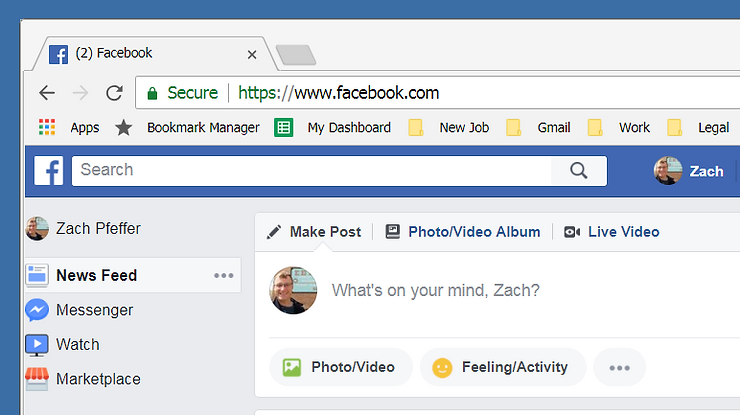

**2\. Limit Who Can See What You Post**

**(1)** Click the **down arrow**, then **(2) Settings**

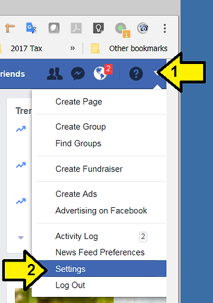

Click **Privacy**

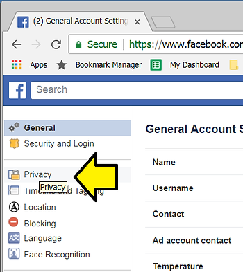

Click on each section 1,2,3,4,5,6,7,8 and update who you'd like to see your posts

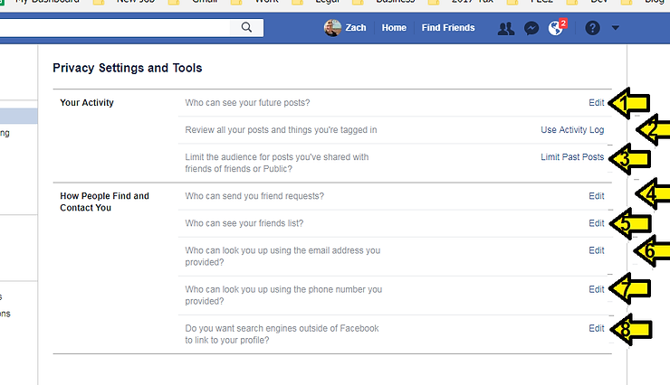

**3\. Don't Share Your Data with Apps**

Revoke your permission to share data with other apps. Click **(1) Apps and Websites, (2) check** each app to revoke permission **(3)** click **Remove**

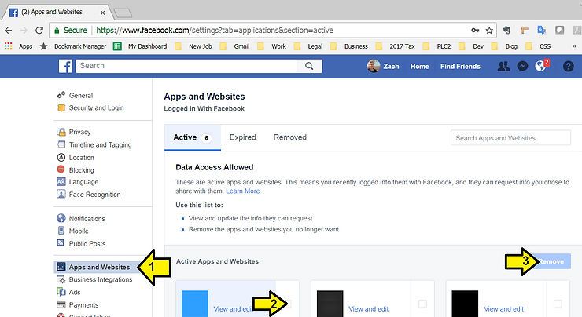

**4\. Turn Off Ad Targeting**

Click **Ads**

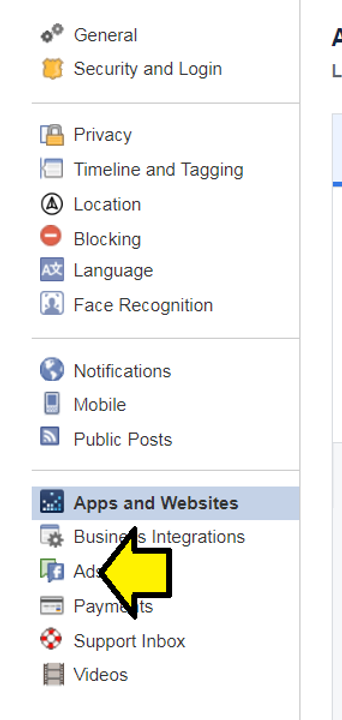

Click on each section and disable or turn off everything

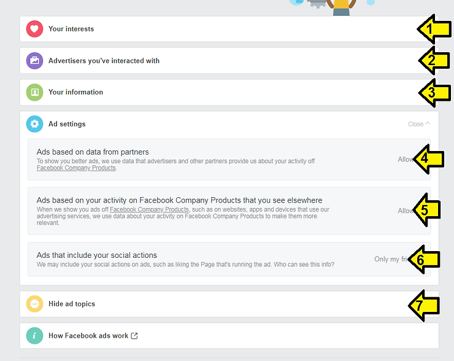

Click the **Back** button on your browser to get back.

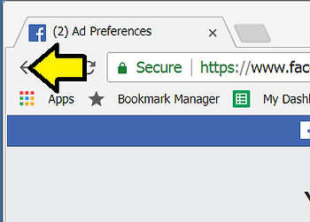

**5\. Start using Firefox @** [**link**](http://www.mozilla.org/en-US/firefox/new/) **and enable Intelligent Tracking Protection**

Download Firefox

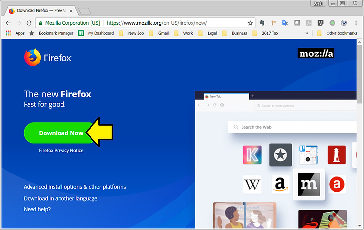

Save it

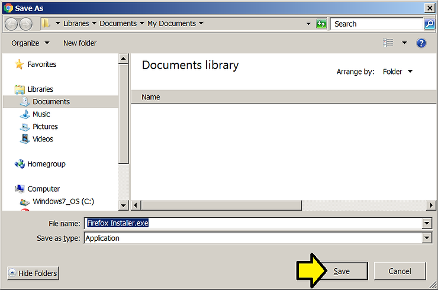

Open the Installer

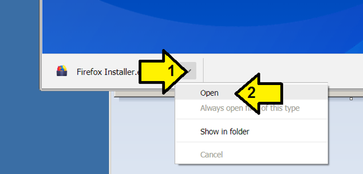

Run the Installer (after this step, accept the various messages to install)

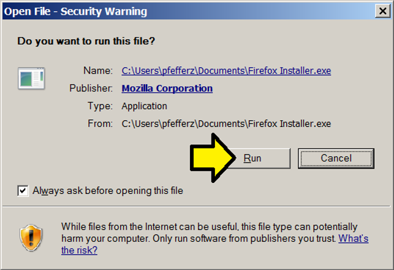

Run Firefox and click here:

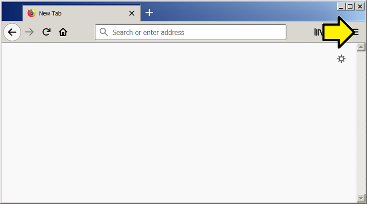

Click O**ptions**

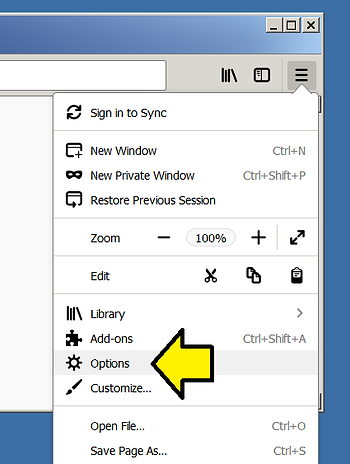

Click **Privacy & Security**

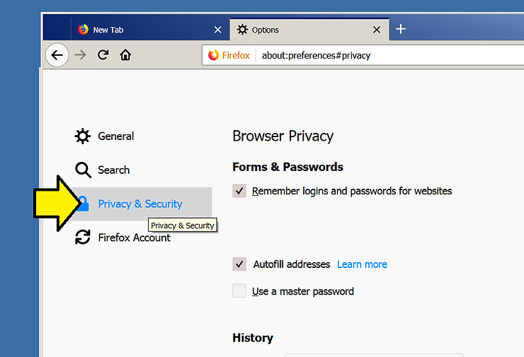

Make sure **Tracking Protection** is set to **Always** (it will be by default)

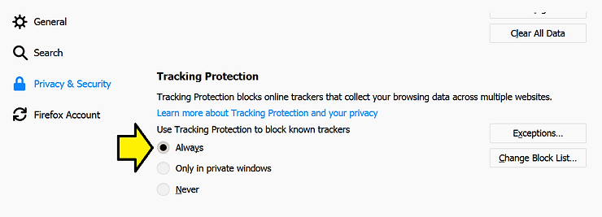

**6\. Run a Privacy Checkup at facebook.com**

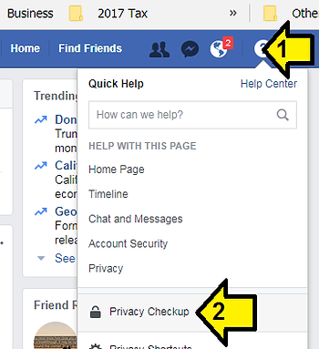

**References**

-   Facebook icon @ [link](http://www.facebook.com/images/fb_icon_325x325.png)
    
-   How To Limit the Amount of Data You Share on Facebook @ [link](http://slate.com/technology/2018/03/how-to-limit-facebook-data-if-you-dont-delete-app.html)