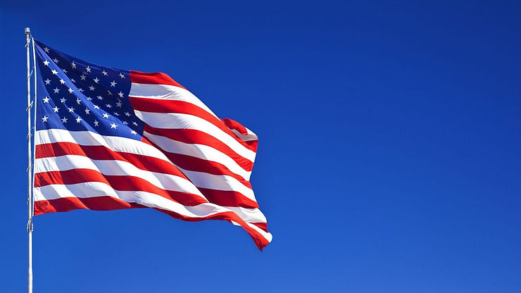

# Links to all Secretary of States Websites and Twitter Handles in the U.S. as of the 2020 Election

Thank you for all your hard work in this election! 

  

Alabama

https://www.sos.alabama.gov/ 

@alasecofstate

Alaska

https://www.elections.alaska.gov/ 

@ak_elections

Arizona

https://azsos.gov/elections 

@SecretaryHobbs

Arkansas

https://www.sos.arkansas.gov/elections 

John Thurston

@ARSecofState

California

https://www.sos.ca.gov/elections 

@CASOSvote

Colorado

https://www.sos.state.co.us/pubs/elections/ 

@COSecofState

Connecticut

https://portal.ct.gov/sots/election-services/election-results/election-results 

@SOTSMerrill

Delaware

https://ivote.de.gov/VoterView 

@delaware_gov

Florida

https://dos.myflorida.com/elections/for-voters/voting/ 

@FLSecofState

Georgia

https://georgia.gov/voting 

@georgiagov 

Hawaii

https://elections.hawaii.gov/voters/voting-in-hawaii-guide/ 

@elections808

Idaho

https://sos.idaho.gov/elections-division/ 

@IDSecOfState

Illinois

https://www.elections.il.gov/ 

@illinoissbe

Indiana

https://www.in.gov/sos/elections/ 

@GovHolcomb

Iowa

https://sos.iowa.gov/elections/electioninfo/general/index.html 

@IowaSOS

Kansas

https://sos.ks.gov/elections/elections.html 

@KansasSOS

Kentucky

https://elect.ky.gov/Pages/default.aspx 

@KYSecState

Louisiana

https://www.sos.la.gov/ElectionsAndVoting/GetElectionInformation/Pages/default.aspx 

@Louisiana_sos

Maine

https://www.maine.gov/sos/cec/elec/ 

@MESecOfState

Maryland

https://elections.maryland.gov/county_status_page_root.html 

@md_sbe

Massachusetts

https://www.sec.state.ma.us/ele/ 

@VotingInMass

Michigan

https://www.michigan.gov/sos/0,4670,7-127-1633-49313--,00.html 

@MichSoS

Minnesota

https://www.sos.state.mn.us/elections-voting/ 

@MNSecofState

Mississippi

https://www.ms.gov/home 

@MississippiSOS

Missouri

https://www.sos.mo.gov/ 

@MissouriSOS

Montana

https://sosmt.gov/ 

@Stapleton_MT

Nebraska

https://sos.nebraska.gov/ 

@NEvnen

Nevada

https://www.nvsos.gov/sos 

@NVSOS

New Hampshire

https://sos.nh.gov/ 

@NHSecretary

New Jersey

https://www.state.nj.us/state/ 

@SecretaryWay

New Mexico

https://www.sos.state.nm.us/ 

@NMSecOfState

New York

https://www.dos.ny.gov/ 

@NYSDO

North Carolina

https://www.sosnc.gov/ 

@NCSecState

North Dakota

https://sos.nd.gov/elections 

@ndgov

Ohio

https://www.ohiosos.gov/ 

@FrankLaRose

Oklahoma

https://www.sos.ok.gov/ 

@oklahoma_sos

Oregon

https://sos.oregon.gov/Pages/index.aspx 

@OregonSOS

Pennsylvania

https://www.dos.pa.gov/Pages/default.aspx 

@PAStateDept

Rhode Island

https://www.sos.ri.gov/ 

@RISecState

South Carolina

https://sos.sc.gov/ 

@scvotes

South Dakota

https://sdsos.gov/ 

@sodaksos

Tennessee

https://sos.tn.gov/   

@sectrehargett

Texas

https://www.sos.state.tx.us/ 

@TXsecofstate 

Utah

https://www.utah.gov/government/secretary-of-state.html 

@ElectionsUtah 

Vermont

https://sos.vermont.gov/elections/ 

@VermontSOS

Virginia

[https://www.elections.virginia.gov/ ](https://www.elections.virginia.gov/)   

@vaELECT

Washington

https://www.sos.wa.gov/elections/ 

@secstatewa 

West Virginia

https://sos.wv.gov/Pages/default.aspx 

@wvsosoffice

Wisconsin

https://sos.wi.gov/ 

@WI_Elections

Wyoming

https://sos.wyo.gov/ 

@WyomingSOS

National Asso­ciation of Secretaries of State

https://www.nass.org/ 

@NASSorg

The Secretary of State for the U.S.

https://www.state.gov/secretary/ 

@StateDept

**References**

U.S. flag found at [[link](https://www.google.com/url?sa=i&url=https%3A%2F%2Fwww.usatoday.com%2Fstory%2Fmoney%2F2019%2F07%2F03%2Fjuly-4th-the-histories-us-flags-for-independence-day%2F39637697%2F&psig=AOvVaw3TrK6plQDWHGe7MNlY8lDN&ust=1604717583948000&source=images&cd=vfe&ved=0CAIQjRxqFwoTCKCBuYD17OwCFQAAAAAdAAAAABAD)]