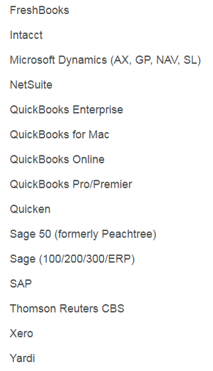

# List of Accounting Software

This post lists accounting software.

**List**

FreshBooks

Intacct

Microsoft Dynamics (AX, GP, NAV, SL)

NetSuite

QuickBooks Enterprise

QuickBooks for Mac 

QuickBooks Online 

QuickBooks Pro/Premier

Quicken

Sage 50 (formerly Peachtree)

Sage (100/200/300/ERP)

SAP

Thomson Reuters CBS

Xero

Yardi

**References**

-   List from bill.com Account setup form
    
-   Optical Character Recognition (OCR) used to extract text at [[link](http://www.onlineocr.net/)\]
    
-   Image from [[link](http://www.topaccountingdegrees.org/wp-content/uploads/2015/08/KCG-Controller-Accounting-Bookkeeping-for-startups-300x200.jpg)\]
    

**Original Image**

