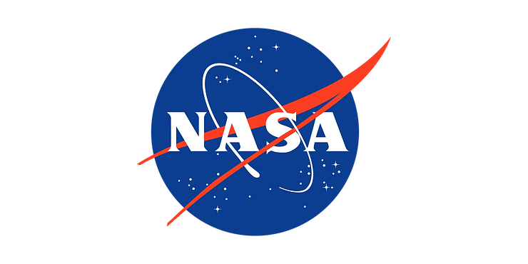

# NASA's Aerospace Technology Resources

NASA suggests the following resources to learn about aerospace technologies. These resources are useful when putting together proposals to solve aerospace problems.

NASA Research Announcement (NRA) 80HQTR20NOA01, Space Technology Research, Development, Demonstration, and Infusion-2020 (SpaceTech-REDDI-2020): [https://nspires.nasaprs.com/external/solicitations/summary!init.do?solId={8710EA44-0AF9-04CC-3709-F27FFA3BD200}&path=open](http://nspires.nasaprs.com/external/solicitations/summary!init.do?solId={8710EA44-0AF9-04CC-3709-F27FFA3BD200}&path=open)

NASA Strategic Plan: [https://www.nasa.gov/sites/default/files/atoms/files/nasa\_2018\_strategic\_plan.pdf](http://www.nasa.gov/sites/default/files/atoms/files/nasa_2018_strategic_plan.pdf)

2020 NASA Technology Taxonomy: [https://www.nasa.gov/offices/oct/taxonomy/index.html](http://www.nasa.gov/offices/oct/taxonomy/index.html)

Guidebook for Proposers Responding to a NASA Funding Announcement, dated March 2018: [https://www.hq.nasa.gov/office/procurement/nraguidebook/](http://www.hq.nasa.gov/office/procurement/nraguidebook/)

Federal Acquisition Regulations (FAR): [http://www.acquisition.gov/far/index.html](http://www.acquisition.gov/far/index.html) or http://farsite.hill.af.mil/

NASA Federal Acquisition Regulations Supplement (NFS): [https://www.hq.nasa.gov/office/procurement/regs/NFS.pdf](http://www.hq.nasa.gov/office/procurement/regs/NFS.pdf)

TRL Descriptions: [https://nodis3.gsfc.nasa.gov/displayDir.cfm?Internal\_ID=N\_PR\_7123\_001C\_&page\_name=main&search\_term=7123%2E1](http://nodis3.gsfc.nasa.gov/displayDir.cfm?Internal_ID=N_PR_7123_001C_&page_name=main&search_term=7123%2E1)

Reference

List from the NASA Innovative Advanced Concepts (NIAC) Phase I Solicitation: 80HQTR20NOA01-21NIAC\_A1 posted at [[link](http://nspires.nasaprs.com/external/viewrepositorydocument?cmdocumentid=753131&solicitationId={9BC1CCC6-3CB9-30BA-8C21-0B88402F4A2A}&viewSolicitationDocument=1)\]

NASA logo from [[link](http://www.nasa.gov/sites/default/files/thumbnails/image/nasa-logo-web-rgb.png)\]