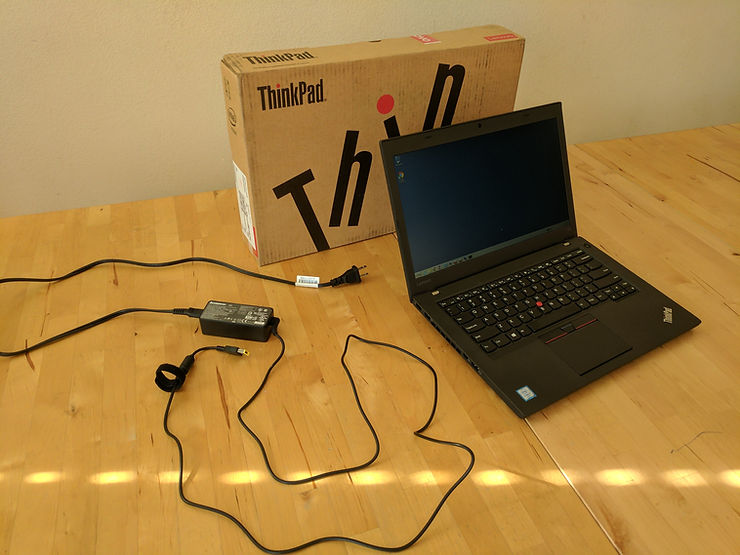

# The computer I want is always $3000

The computer I want is always $3000. The computer I need is usually $2000.

I recently picked up a ThinkPad T460 model 20FNCTO1WW for $1,830.59 (spec below) after considering the [Dell XPS 15.](http://www.dell.com/en-us/shop/productdetails/xps-15-9560-laptop?ST=xps%2015&dgc=ST&cid=297819&lid=5695354&acd=123098073120560&ven1=sPyVmJDKS&ven2=e&ven3=263403736553147397) I went with the T460 because of:

1.  Reports of quality issues after 3-6 months with the XPS [[1](http://www.reddit.com/r/Dell/comments/4u0v3m/ok_lets_get_real_here_with_the_xps_15/)\][[2](http://forum.notebookreview.com/threads/dell−xps−15−9550−list−of−hardware−and−software−problems.784691/)\][[3](http://en.community.dell.com/support−forums/laptop/f/3518/t/19662879?rfsh=1448921878757)\]
    
2.  Experience with Dell hardware failing (a [e7450](http://www.laptopmag.com/reviews/laptops/dell-latitude-e7450) failing to sleep or turn on at all due to bad motherboards)
    
3.  Experience with my [W520](http://shop.lenovo.com/us/en/laptops/thinkpad/w-series/w520/) ThinkPad holding up to world travel and [bike commuting](http://www.strava.com/athletes/5781977)
    
4.  Reports of a great keyboard
    

###### Documentation

All of the documentation for the T460 20FNCTO1WW is listed [here](http://pcsupport.lenovo.com/us/en/products/laptops-and-netbooks/thinkpad-t-series-laptops/thinkpad-t460/20fn/cto1ww/documentation?searchLocation=PSPDoc_S).

###### Specs

To get this information on your computer use either of these on Windows 7 Pro:

Start > All Programs > Accessories > System Tools > System Information

c:\\Users\\username>msinfo32.exe

-   OS Name: Microsoft Windows 7 Professional
    
-   Version: 6.1.7601 Service Pack 1 Build 7601
    
-   OS Manufacturer: Microsoft Corporation
    
-   System Manufacturer: LENOVO
    
-   System Model: [20FNCTO1WW](http://shop.lenovo.com/us/en/laptops/thinkpad/t-series/t460/?menu-id=thinkpad_t460)
    
-   System Type: x64-based PC
    
-   Processor: [Intel(R) Core(TM) i7-6600U CPU @ 2.60GHz, 2701 Mhz, 2 Core(s), 4 Logical Processor(s)](http://processors.specout.com/l/1875/Intel-Core-i7-6600U#Specifications&s=3nYLtd)
    
-   BIOS Version/Date: LENOVO R06ET47W (1.21 ), 11/30/2016
    
-   SMBIOS Version: 2.8
    
-   Hardware Abstraction Layer: Version = "6.1.7601.17514"
    
-   Installed Physical Memory (RAM): 12.0 GB PC3-12800 DDR3L (2 DIMM)
    
-   Display: 14.0" FHD IPS (1920 x 1080),Touch,No WiGig,WWAN,WLAN
    
-   Graphics: [Intel HD Graphics 520](http://www.intel.com/content/www/us/en/support/graphics-drivers/graphics-for-6th-generation-intel-processors/intel-hd-graphics-520.html), 1824 MB Total Graphics Memory, 192 MB Dedicated, System Video Memory 0 MB, Shared System Memory: 1632 - [how to find this out](http://www.intel.com/content/www/us/en/support/graphics-drivers/000005510.html) - [Tom's Hardware](http://www.tomshardware.com/reviews/gpu-hierarchy,4388.html)
    
-   Camera: 720p HD Camera
    
-   Hard Drive: [512GB Solid State Drive, SATA3 (MZ7LN512HMJP-000)](http://www.samsung.com/semiconductor/products/flash-storage/client-ssd/MZ7LN512HMJP?ia=831)
    
-   Front Battery: ThinkPad Battery 3 cell Li-Ion (23.2Whr) Front
    
-   Rear Battery: ThinkPad Battery 6 cell Li-Ion (72Wh) Cyl HC Rear
    
-   Wireless: Intel Dual Band Wireless-AC(2x2) 8260, Bluetooth Version 4.1
    
-   Ethernet Connection I219-LM Ethernet 802.3
    
-   Intel(R) 6th Generation Core Processor Family Platform I/O SATA AHCI Controller
    
-   Intel(R) USB 3.0 eXtensible Host Controller
    

###### Notes

-   One thing I tried to find on Lenovo's site was how much the 6 cell Li-Ion (72Wh) Cyl HC Rear Rear Battery makes the computer stick up. I found [this](http://forums.lenovo.com/t5/ThinkPad-T400-T500-and-newer-T/Difference-between-6-Cell-Li-iion-Cyl-HC-Rear-72Wh-and-6-Cell-Li/td-p/1632536) which linked to [this](http://forum.notebookreview.com/attachments/batt2-jpg.108160/), but I couldn't find an image that showed the actual laptop. For the benefit of others, here's how much the battery causes the computer to stick up.
    
-   Regarding Dell hardware, my [Dell Precision 7510](http://www.dell.com/us/business/p/precision-m7510-workstation/pd) has held up. Its a bit on the heavy side though.
    

**Misc**

-   The Ubuntu on Lenovo ThinkPad T460 hardware certification is available at [link](http://certification.ubuntu.com/certification/hardware/201605-22282/) (all the certs for all Lenovo products are [here](http://pcsupport.lenovo.com/us/en/products/laptops-and-netbooks/thinkpad-t-series-laptops/thinkpad-t460/20fn/cto1ww/parts/PD031426))
    
-   I've also copied some these docs to my Google drive so that if Lenovo every takes them down I still have access
    
-   Windows 8.1 Getting Started at [link](http://drive.google.com/open?id=1Slibr_wpenqC2QeT8Mtk4NbcQuffVwHU)
    
-   Using the Windows 10 Lenovo Factory Recovery USB Key at [link](http://drive.google.com/open?id=1AhoArwzSKeC6idhbaHVbdyLkx_aFf_Eb)
    
-   T460 User's Guide at [link](http://drive.google.com/open?id=1vdCFaz7m5HHRv9vHX4ezz_OPYcq4aycU)
    
-   T460 Hardware Maintenance Manual at [link](http://drive.google.com/open?id=1ZCxKbg9TvXbm7IgGy_4TjTDO2GYf7gkL)
    

**Sep 30th 2018 Update**

Wrote [ThinkPad T460 Memory Upgrade](http://www.zachpfeffer.com/single-post/2018/09/29/ThinkPad-T460-Memory-Upgrade) after I decided to upgrade the memory to 32 GB after starting to do more programmable logic design work with Vivado (which requires a \_lot\_ of memory, see [[link](http://www.zachpfeffer.com/single-post/Xilinx-20182-Software-Tool-Installation-Overview-and-Assessment)\] which reports memory needs topping out at 50 GB!).

**Apr 6th 2018 Update**

The laptop seems to be holding up after a more than a year. Over that year I was using the Dell Precision 7510 for a lot of workloads and only using the T460 for lighter duties. Over the last 4 months I've just had the T460 and I've been using it for the workloads I was using the 7510 for. With the higher usage I've noticed that Virtual Box is a bit slower and that I need to close Chrome more often because it seems to take up a lot of memory when I use it.

The battery life is \_way\_ better than the 7510.

The keyboard also continues to be very nice.

Going forward I'm considering moving into the cloud since many of the Xilinx workloads require many 10's of GB's of memory and many 100's of GB's of storage.