# Place to Work in Vegas

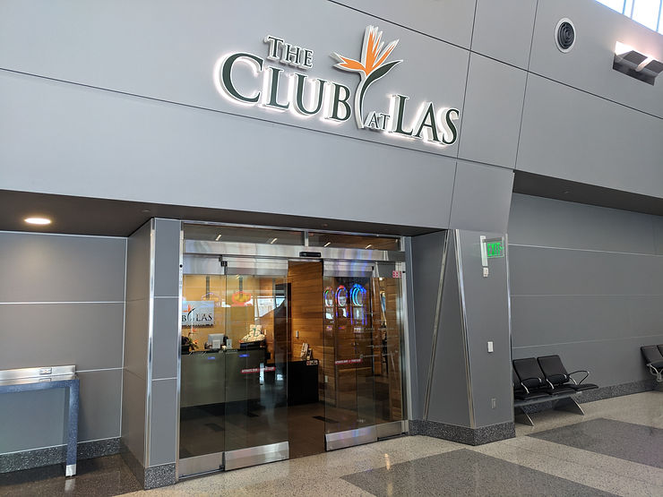

This post gives a first hand experience of the **The Club at Las Vegas** [link\]. Note: you want to go to the location in Terminal 3 by the E2 gate. The location by the D gates is a satellite and does not have as many services.

**Experience**

Looking for **a quiet place to work** close to the Vegas strip with food, coffee and WiFi? Check out **The Club at Las Vegas**.

If you've come to Vegas for a conference and you need to or would like to get some work done go over to Terminal 3 by gate E2.

When I visited on Sept 4th 2018 they had a fresh salad bar, soup, open bar, coffee, cookies, Jelly Bellys [[link](http://www.jellybelly.com/)\], fruit, Cup Noodles, chips, fruit, strawberry water, great places to work and a **shower**.

**WiFi**

They also had great WiFi. Here were the results form speedtest.net:

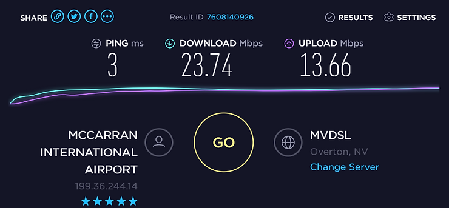

3 ms ping, 23.74 Mbps download, 13.66 Mbps upload from MVDSL.

**Pictures**

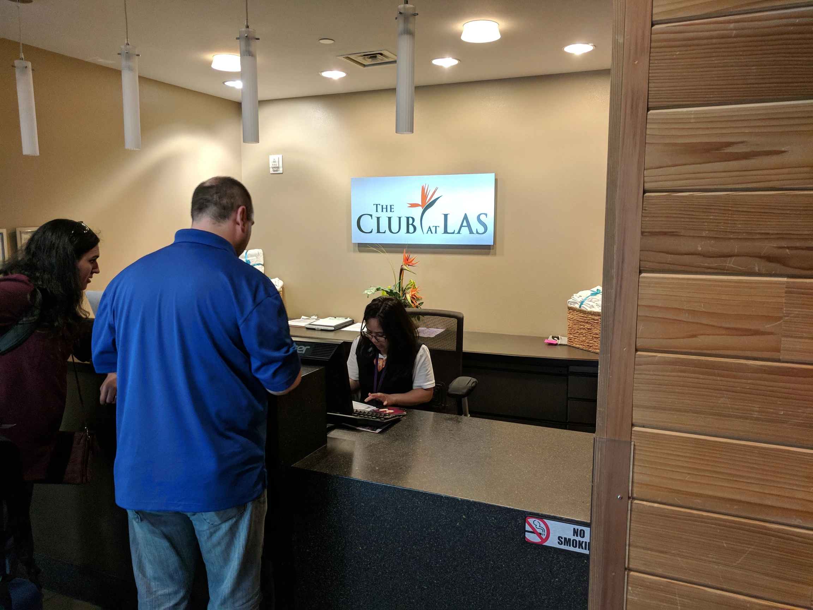

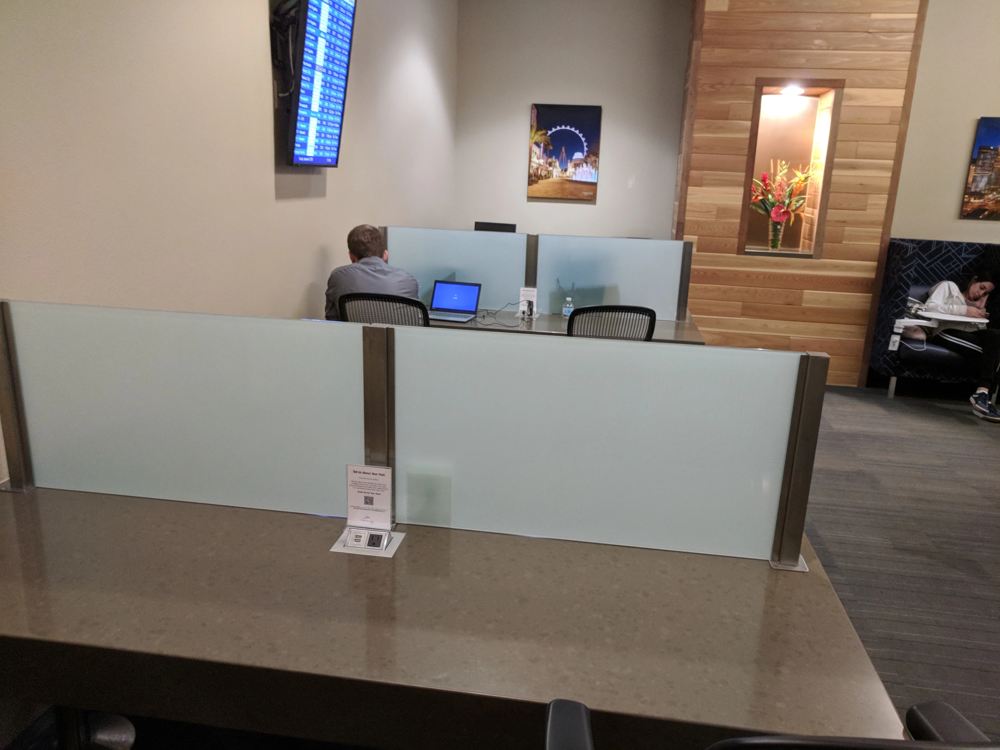

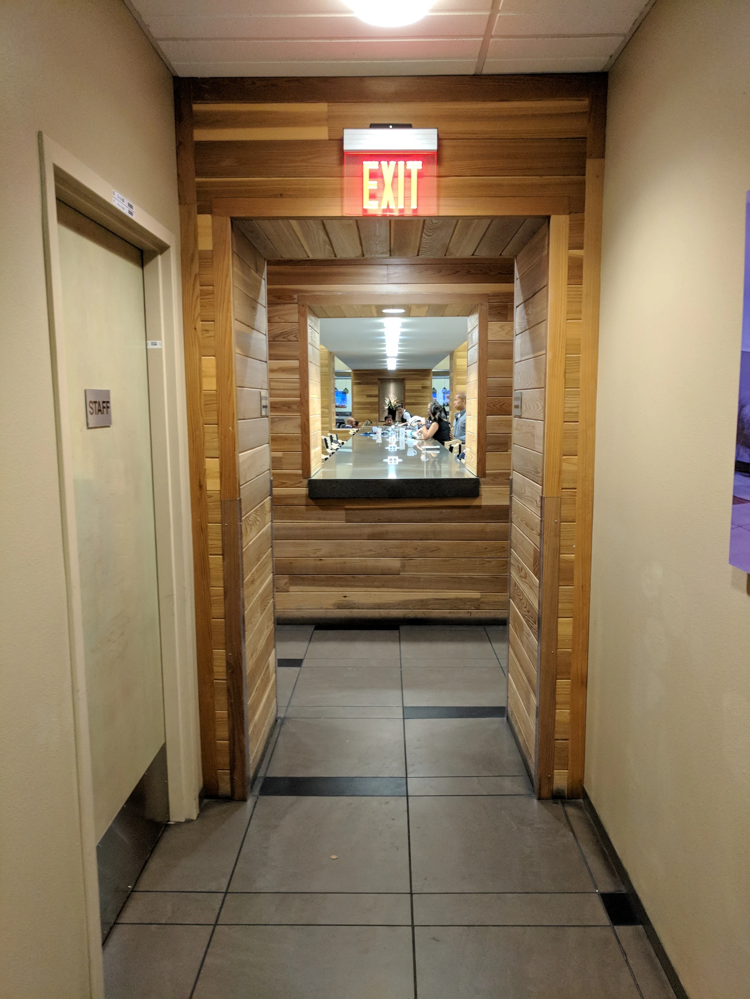

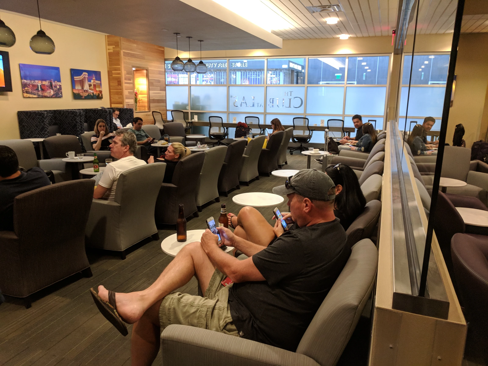

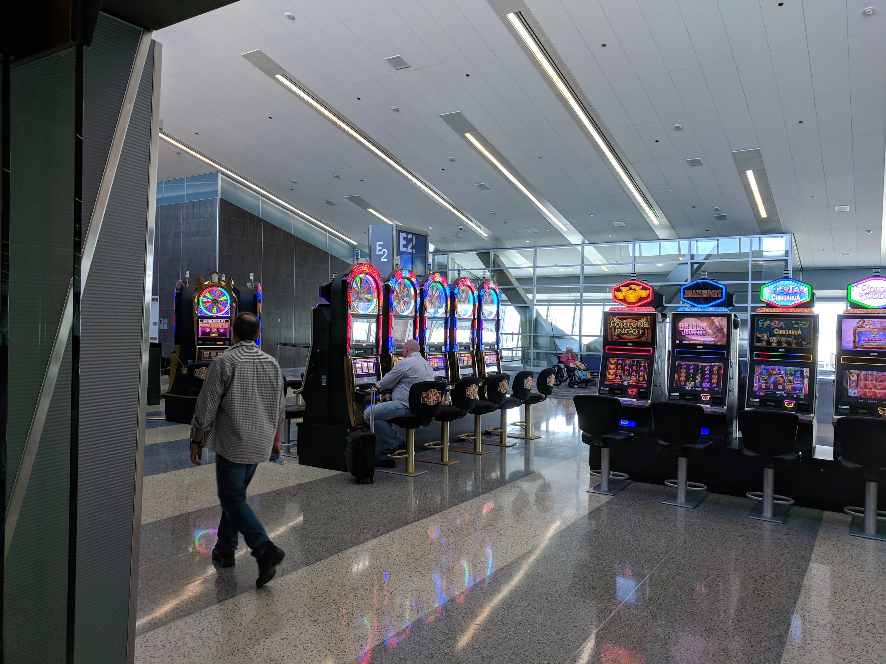

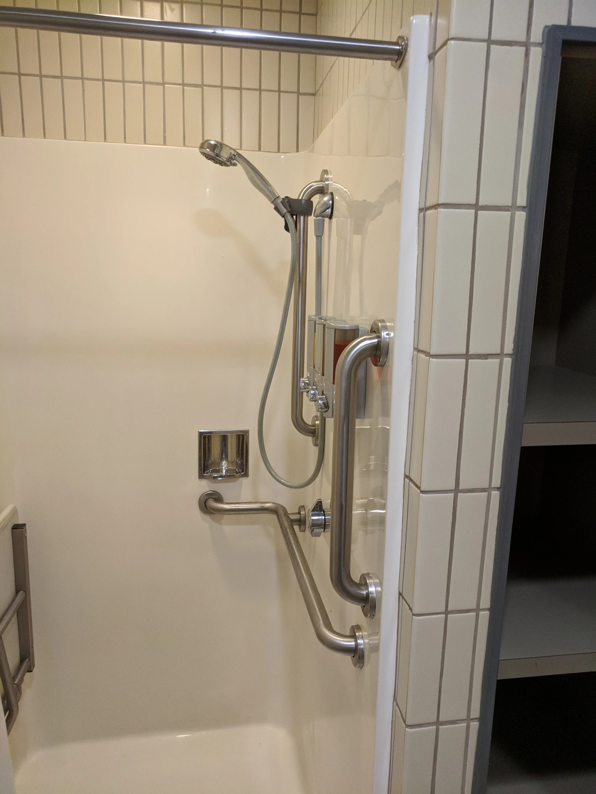

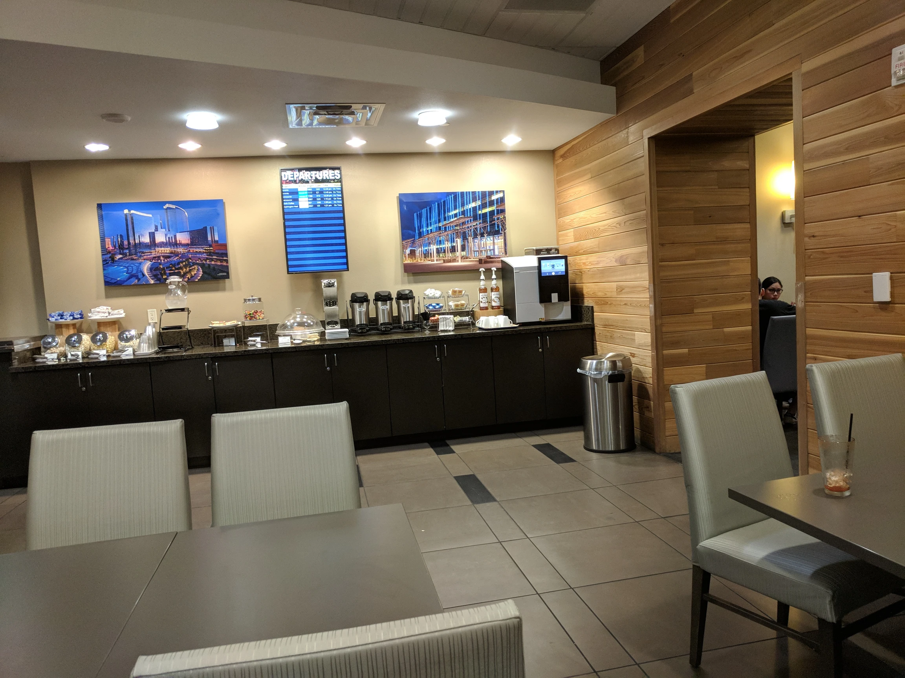

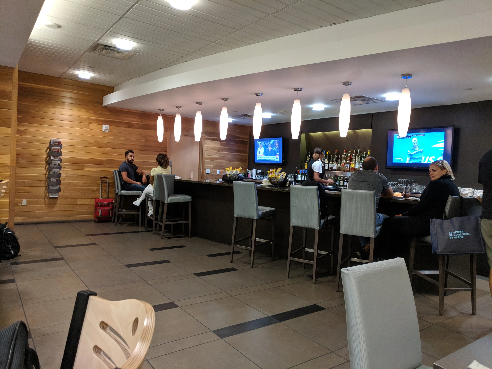

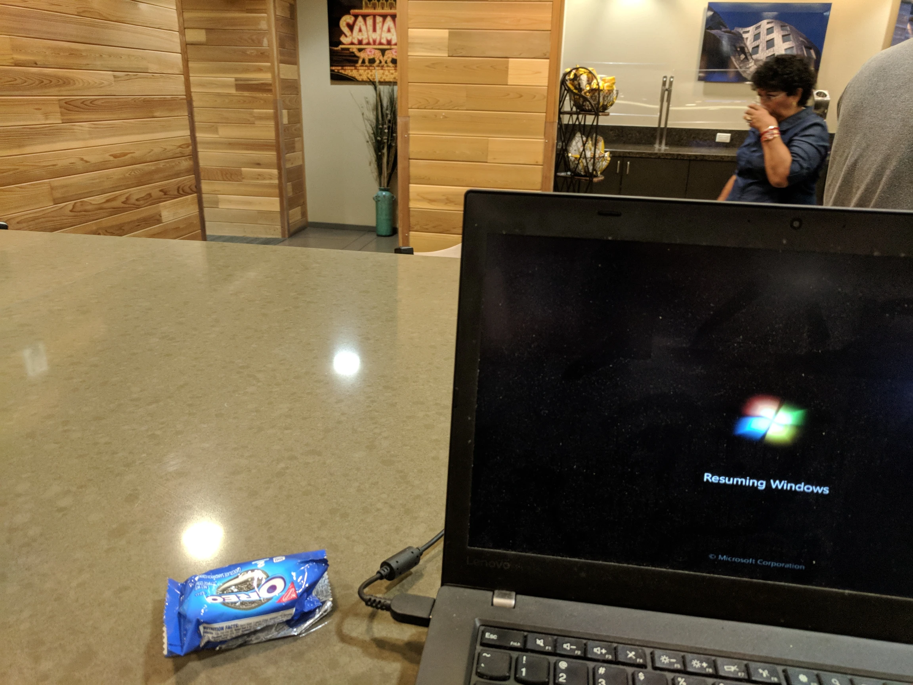

**Other Things**

There were two other things I liked about the lounge

1) People Watching

People of all walks of life, mostly relaxed getting ready to go home from their Vegas vacation.

2) Nice Staff

The staff on the day I went was awesome. Nice, made sure all the food was stocked and dishes cleared.

All for $40.00. The best deal in Vegas.

**Inspriation**

I thought of this after watching this video about a guy who buys an airline ticket to get into the airport lounge, works then gets a ticket refund [[link](http://youtu.be/HWYhRGsITM0)\].

**Other Thoughts**

Oh yeah...and if you want, you can play slots right outside in a smoke free environment.