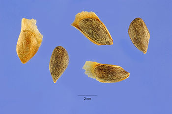

# Seed Financing, Cap Table and Terms Walk-Through

This post is a Seed financing round walk-through that presents the **capitalization table** and **investment terms** produced from the round.

**Walk-Through**

**Before the Round**

Tricia and Ford have created a robot prototype that allows older people to stay in their homes longer.

They have spent $50,000 from their savings, credit cards and friends and family to finance the prototype. They are seeking **Seed financing** to refine the prototype and the business model. They have the resources to continue investing in the prototype, but they would like to find an **Angel Investor** who would:

-   Provide resources to accelerate their work and provide financial assurances to the initial customers,
    
-   Be a "gate," e.g. if they can't convince someone to invest in the idea the idea may not be economically viable,
    
-   Provide additional guidance on the market and
    
-   Be as passionate about the opportunity as they are
    

**Preparation**

Tricia and Ford create a business plan outlining the pains the robot addresses. They include how the robot addresses those pains in an economically viable way. After creating their plan they anticipate needing $300,000 to complete their production beta in 1 year. They will use the money to: rent a space, hire 4 engineers and 1 program manager and manufacture 3 robots for 2 customers they have identified. The customers have expressed interest, but have not made a commitment, i.e. the customers have not created a purchase order (PO) for the robots. The team will use the $300,000 to work toward a PO with the 2 customers.

**Finding the Angel**

Tricia contacts the alumni coordinator where she went to school. Ford, a self taught engineer, reaches out to his family's business contacts. After 2 months and a few interviews, Tricia and Ford have selected two Angels who meet the above criteria: a successful business leader name Meg and a former boxing champ named Ronda. Meg has agreed to put up $200,000 and Ronda will put up $100,000.

**The Details**

Tricia, Ford, Meg and Ronda sit down and discuss how much the company is worth, a.k.a. the **valuation**. With the plan and her own business acumen Meg concluded that the company was worth $1 million "post-money," i.e. after Meg and Ronda put in their $300,000. This implied the company was worth $700,000 "pre-money." and "on-paper" Tricia and Ford's stake is worth $700,000. Tricia, Ford and Ronda concur.

To codify the agreement, Tricia, Ford, Meg and Ronda write up a stock purchase agreement. In the agreement they state that everyone will get common stock (the **type of security**). Tricia will own $350,000 in stock, Ford will own $350,000 in stock, Meg will own $200,000 in stock and Ronda will own $100,000 in stock. The team agrees that there will be only no **anti-dilutive protections** put in place. They do agree that all parties will contribute 10% of their stock to a common stock pool for employee options before any future financing rounds. Finally, because Meg and Ronda will hold common stock they will have no **liquidation rights** (these rights will likely be needed later if the venture requires more capital).

The founders explicitly list that all common stock share holders are able to **govern** the company in proportion to their ownership stake, i.e. they are able to "vote their shares" to elect members of the board of directors and to approve material corporate events such as the sale of the company. "Voting their shares" means that they will be able to allocate their shares in a vote, e.g. if Tricia and Meg vote all their shares to elect a board member that board member would be elected because together they own 55% of the company.

**Last Steps**

Meg helps the team finds a securities law firm that can draft the "term sheet," a stock purchase agreement and the company's articles of incorporation. She shares with her new partners that a sole practitioner could do the work, but she anticipates that the company will need additional rounds of funding. The new team agrees, the agreements are drafted and signed and Tricia and Ford continue to ramp up their operations.

**Summary**

**Capitalization Table for the Round**

|        |                     |                        |      | Post-Round Ownership |
| ------ | ------------------- | ---------------------- | ---- | -------------------- |
|        | Pre-Round Ownership | New Capital Commitment | %    | $ (thousands)        |
| Tricia | 50%                 | $0.00                  | 35%  | $350.00              |
| Ford   | 50%                 | $0.00                  | 35%  | $350.00              |
| Meg    | 0%                  | $200.00                | 20%  | $200.00              |
| Ronda  | 0%                  | $100.00                | 10%  | $100.00              |

**Investment Terms**

| Term                    | Agreement                                                   |
| ----------------------- | ----------------------------------------------------------- |
| Type of security        | Common stock                                                |
| Valuation               | $1 million; Tricia: 35%, Ford: 35%, Meg: 20% and Ronda: 10% |
| Governance              | Rights proportional to stock ownership                      |
| Participation rights    | No special rights in future financing                       |
| Antidilution protection | No special rights in future financing / 10% to common pool  |
| Liquidation preferences | No special rights in future financing                       |

**Note**: governance, participation rights, antidilution protection and liquidation preferences may all be revisited based on possible "future" financing. These rights would be associated with additional **preferred stock** that would be granted in future funding rounds.

**References**

-   Picea pungens seeds found via Google image search. Available at [[link](http://commons.wikimedia.org/wiki/File:Piceapungensseeds.jpg)\].
    
-   Table generator at [[link](http://tabletag.net/)\].
    
-   Material derived from _The Wall Street Primer: The Players, Deals, and Mechanics of the U.S. Securities Market, Nov 30, 2008 by Jason A. Pedersen_. Available from Amazon at [[link](http://www.amazon.com/Wall-Street-Primer-Mechanics-Securities-ebook/dp/B0027VSQE2/ref=sr_1_1?s=books&ie=UTF8&qid=1534890072&sr=1-1&keywords=9780313365164&dpID=51HY2f3x4aL&preST=_SY445_QL70_&dpSrc=srch)\].