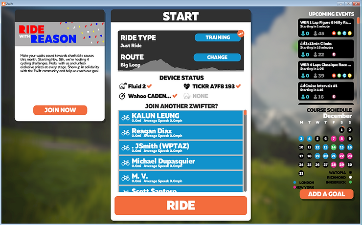

# Sequence of Steps that Work when Running Zwift with a Wahoo Cadence, Speed and Heart Rate Sensor

This post gives a sequence of steps that ensure that Zwift running on a Window's PC talking to the Companion App running on Android always starts with a connection to the Wahoo cadence, speed and heart rate sensor.

1\. Start **Zwift** on the **Windows PC**

2\. Start the **Companion App** on **Android**

3\. Pedal the pedals by hand and put on your heart rate monitor

You should see:

You have about 30 seconds to start riding.

4\. Quickly click **OK**

You should see something like:

5\. Click **RIDE**

6\. Get on your bike and start pedalling!