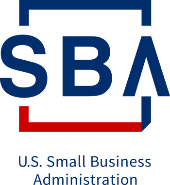

# The SBIR Policy Directive a.k.a. the Doc with Definitions of all the SBIR/STTR terms

This post suggests that SBIR/STTR **Applicants** read the "Small Business Innovation Research (SBIR) and Small Business Technology Transfer (STTR) Program Policy Directive Effective: May 2, 2019." to find the official definitions of terms like "**Applicants"** for the SBIR/STTR program.

**Overview**

I recently came across the SBIR/STTR document that contains all of the definitions and guidelines for all of the SBIR/STTR programs, the "Small Business Innovation Research (SBIR) and Small Business Technology Transfer (STTR) Program Policy Directive Effective: May 2, 2019."

**The Doc**

Link: [SBIR-STTR_Policy_Directive_2019.pdf](SBIR-STTR_Policy_Directive_2019.pdf) 

**Some Excerpts**

On the SBIR/STTR process on page 54:

_(e) In general, each Participating Agency must make SBIR/STTR awards for R/R&D_ _through the following uniform, three-phase process:_

_(1) Phase I awards to determine, insofar as possible, the scientific and technical merit and feasibility of ideas that appear to have commercial potential._ 

_(2) Phase II awards to further develop work from Phase I that meets particular program needs and exhibits potential for commercial application._ 

_(3) Phase III awards where commercial applications of SBIR/STTR program-funded R/R&D are funded by non-Federal sources of capital; or where products, services or further research intended for use by the Federal Government are funded by nonSBIR/STTR sources of Federal funding_

The definition of **Commercialization** on page 57:

_(f) Commercialization. The process of developing products, processes, technologies, or services and the production and delivery (whether by the originating party or others) of the products, processes, technologies, or services for sale to or use by the Federal Government or commercial markets_

The definition of **Innovation** on page 60:

_(t) Innovation. Something new or improved, having marketable potential, that includes the development of new technology, the refinement of existing technology, or the development of new applications for existing technology._

The definition of **Research or Research and Development (R/R&D)** on pages 61 and 62:

_(dd) Research or Research and Development (R/R&D). Any activity that is: (1) a systematic study directed toward greater knowledge or understanding of the subject studied; (2) a systematic study directed specifically toward applying knowledge and innovation to meet a recognized but unmet need; or (3) a systematic application of knowledge and innovation toward the production of useful materials, devices, and systems or methods, including design, development, and improvement of Prototypes and new processes to meet specific requirements._

On the **topics in a solicitation**, i.e. the actual topic you're applying for on page 81 under 5. Program Solicitation Process (a) Topics/Subtopics on page 81:

_Topics and subtopics must emphasize the need for proposals with advanced concepts to meet specific agency R/R&D needs. Each topic and subtopic must describe the needs in sufficient detail to assist in providing on-target responses, but cannot involve detailed specifications to prescribed solutions of the problems._

On page 90 it lists the **elements** each proposal for an **SBIR/STTR Phase II Commercialization Plan** should contain:

_(i) Company information. Focused objectives/core competencies; specialization area(s); products with significant sales; and history of previous Federal and non Federal funding, regulatory experience, and subsequent Commercialization._

_(ii) Customer and Competition. Clear description of key technology objectives, current competition, and advantages compared to competing products or services; description of hurdles to acceptance of the innovation._

_(iii) Market. Milestones, target dates, analyses of market size, and estimated market share after first year sales and after 5 years; explanation of plan to obtain market share._

_(iv) Intellectual Property. Patent status, technology lead, trade secrets or other demonstration of a plan to achieve sufficient protection to realize the commercialization stage and attain at least a temporal competitive advantage._

_(v) Financing. Plans for securing necessary funding in Phase III._

_(vi) Assistance and mentoring. Plans for securing needed technical or business assistance through mentoring, partnering, or through arrangements with State assistance programs, SBDCs, Federally-funded research laboratories, Manufacturing Extension Partnership centers, or other assistance providers._

Note: these are good elements to have in most commercialization plans

On page 95 and 96 under 7. Program Funding Process (f) Payment Schedules and Cost Principles it lists info about costs allowable under Funding Agreements that may be **useful info when listing costs in a proposal**:

_(2) All SBIR/STTR Funding Agreements must use, as appropriate, current cost principles and procedures authorized for use by the Participating Agencies. By the time of award, agencies must have informed each Awardee of the applicable Federal regulations and procedures that refer to the costs that, generally, are allowable under Funding Agreements._

On page 109 it lists a requirement that Awardee's **only purchase American-made equipment and products, to the extent possible**

_(i) American-Made Equipment and Products. Congress intends that the Awardee of a Funding Agreement under the SBIR/STTR program should, when purchasing any equipment or a product with funds provided through the Funding Agreement, purchase only American-made equipment and products, to the extent possible, in keeping with the overall purposes of this program. Each SBIR/STTR Agency must provide to each Awardee a notice of this requirement._

On pages 111 to 112 the document lists the **following priorities each federal agency** should follow, the fact that agencies should give priority to business that **focus on energy** and should include tech from the Science and Technology Policy Institute's report.

_(i) give priority in the SBIR/STTR program to manufacturing-related research and development in accordance with Executive Order 13329 \[_[_link_](http://www.gpo.gov/fdsys/pkg/FR-2004-02-26/pdf/04-4436.pdf)_\]. In addition, agencies must develop an Action Plan for implementing Executive Order 13329, which identifies activities used to give priority in the SBIR/STTR program to manufacturing-related research and development. These activities should include_ _the provision of information on the Executive Order on the agency's SBIR/STTR program website._

_(ii) give priority to SBCs that participate in or conduct energy efficiency or renewable energy system research and development projects._

(iii) give consideration to topics that further one or more critical technologies as identified by the National Critical Technologies panel (or its successor) in reports required under 42 U.S.C. 6683 [*link*](USCODE-1994-title42-chap79-subchapVI-sec6683.pdf) (related: the Critical Technologies Institute name was changed to the Science and Technology Policy Institute [link](http://www.ida.org/en/ida-ffrdcs/science-and-technology-policy-institute), or the Secretary of Defense in accordance with 10 U.S.C. 2522 [link](USCODE-2018-title10-subtitleA-partIV-chap148-subchapIV-sec2522.pdf). 

On pages 153 to 161 lists **12\. Supporting Programs and Initiatives** that are worth reviewing if you need help and/or resources to develop an SBIR/STTR proposal:

_(a)_ **_Federal and State Technology (FAST) Partnership Program_**_. The purpose of the FAST program is to strengthen the technological competitiveness of SBCs in the United States._

_(b)_ **_Commercialization Readiness Program_** _(CRP) - DoD_ _(1) General. The Secretary of Defense and the Secretary of each military department is authorized to create and administer the Commercialization Readiness Program (CRP) to accelerate the transition of technologies, products, and services developed under the SBIR program to Phase III, including the acquisition process._

_(c)_ **_Commercialization Readiness Pilot Program for Civilian Agencies_**_._ _(1) General. The Commercialization Readiness Pilot Program permits the head of any Federal Agency participating in the SBIR program (except DoD) to allocate not more than 10% of its funds allocated to the SBIR program--_

_(i) for follow-on awards to small businesses for technology development, testing, evaluation, and Commercialization assistance for SBIR or STTR Phase II technologies; or_ _(ii) for awards to small businesses to support the progress of research, research and development, and Commercialization conducted under the SBIR or STTR programs to Phase III._

_(d)_ **_Technology Development Program_**_. The Act permits an agency that has established a Technology Development Program to review for funding under that program, in each fiscal year:_ _(1) any proposal to provide outreach and assistance to 1 or more SBCs interested in participating in the SBIR program, including any proposal to make a grant or loan to a company to pay a portion or all of the cost of developing an SBIR proposal, from an entity, organization, or individual located in—_

_(i) a State that is eligible to participate in that Technology Development Program;_ _or_ _(ii) an Additionally Eligible State._

_(2) any meritorious proposal for an SBIR Phase I award that is not funded through the SBIR program for that fiscal year due to funding constraints, from an SBC located in a State identified in (i) or (ii) immediately above._

_(e)_ **_[STTR only] Phase 0 Proof of Concept Partnership Pilot Program_**_._

_(1) General. The Director of NIH may use $5,000,000 of the funds allocated for the STTR program set forth in § 2(b) of this Policy Directive for a Proof of Concept Partnership Pilot Program to accelerate the creation of small businesses and the Commercialization of research innovations from qualifying institutions._

**Call to Action**

I would encourage anyone applying for an SBIR/STTR to ensure their proposal is receptive to the larger goals of the SBIR/STTR program by reading this document.

**Reference**

SBA Logo from [[link](http://www.sba.gov/brand/visual-identity/logo/)\]
