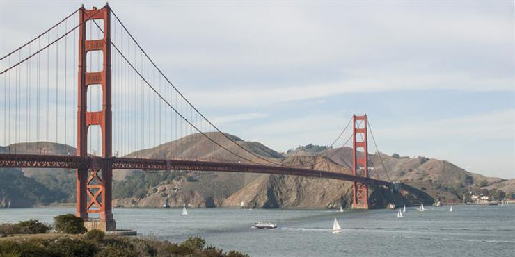

# Things to See and Do In and Around San Francisco

This post lists some things to see and do around San Francisco that my amazing wife and great kids helped me make for one of my cool sisters. Distances are given from the The Ritz-Carlton, Half Moon Bay. I list directions and some details so that you can find everything in one place. Leave a message if I left off a detail you think is important or if you have a suggestion on another great place to visit.

Why the Ritz? My sisters and her family is staying there. She asked for the list for their upcoming trip and I thought I'd share my recommendations with everyone.

**San Francisco**

See the lions and other animals at the **San Francisco Zoo** [[link](http://www.sfzoo.org/)\]

-   San Francisco Zoo, Sloat Blvd & Great Highway, San Francisco, CA 94132 [[link](http://goo.gl/maps/ffbpJFvdkPt)\]
    
-   Car directions from Half Moon Bay at [[link](http://goo.gl/maps/nTjug8DX9Vy)\] (25.9 miles)
    
-   Facebook page at [[link](http://www.facebook.com/sanfranzoo/)\]
    
-   Zoo map at [[link](http://www.sfzoo.org/visit/zoo-map.html)\]
    
-   Visitor Guide at [[link](http://www.sfzoo.org/pdf/map/VisitorGuide%20060818-5.pdf)\]
    
-   Non-resident ticket prices on July 1st 2017: Adult (15-64) $20.00, Seniors (65+) 0 $17.00, Children (4-14) $14.00, Children (3 and under) $0.00 [[link](http://tickets.sfzoo.org/)\]
    
-   Note: SF Zoo tracks the number of tickets its sells and may sell out
    
-   Hours: 10:00 AM to 5:00 PM, last admission at 4:00 PM
    

Visit the California Academy of Sciences [[link](http://calacademy.org/)\] and have a picnic in **Golden Gate Park** [[link](http://goldengatepark.com/)\]

-   55 Music Concourse Dr, San Francisco, CA 94118 [[link](http://goo.gl/maps/MKEEuKFHed12)\]
    
-   Car directions from Half Moon Bay at [[link](http://goo.gl/maps/DSJ168xGzXv)\] (31.5 miles)
    
-   Park at 800 10th Ave, San Francisco, CA 94118 [[link](http://goo.gl/maps/2tnzHBmrrHv)\]
    
-   Tickets at [[link](http://www.calacademy.org/buy-tickets)\]
    
-   Adult Ticket (Ages 18-64) $39.95
    
-   Child Ticket (Ages 4-11) $29.95
    
-   Youth Ticket (Ages 12-17) $34.95
    
-   Student Ticket (Ages 18+, ID required) $34.95
    
-   Senior Ticket (Ages 65+, ID required) $34.95
    

Walk across the **Golden Gate Bridge** [[link](http://www.presidio.gov/places/golden-gate-bridge)\]

-   Golden Gate Bridge, San Francisco, CA 94129 [[link](http://goo.gl/maps/A5LtRNPqXHE2)\]
    
-   Car directions from Half Moon Bay at [[link](http://goo.gl/maps/Vqx8z4bStdy)\] (34.3 miles)
    
-   Park at [[link\]](http://goo.gl/maps/KTKXwAjXT3N2)
    

Take a **Cable Car** [[link](http://www.sfmta.com/getting-around/muni/cable-cars)\], see the **Cable Car Museum** [[link](http://www.cablecarmuseum.org/)\] and visit **Ghirardelli Square** [[link](http://www.ghirardellisq.com/)\]

-   Ghirardelli Square, 900 North Point St, San Francisco, CA 94109 [[link](http://goo.gl/maps/uM9Leb2SRd62)\]
    
-   Car directions from Half Moon Bay at [[link](http://goo.gl/maps/6VUDraDeq1v)\] (35.1 miles)
    
-   Parking to ride a Cable Car at Ghirardelli square [[link](http://www.ghirardellisq.com/visit/)\]
    
-   First hour $5, each additional $8, 12 hours $35, 24 hours $40
    
-   Book parking at [[link](http://www.parkingpanda.com/ghirardelli-square-san-francisco-parking?ref=ghirardelli)\]
    
-   Fares: Cable car conductors will accept the following:
    
-   Single ride
    
-   Fares may be paid on-board to the Cable Car conductor.
    
-   Please have small bills available.
    
-   Transfers between cable cars are not offered.
    
-   If you depart one vehicle, you must pay full fare to board another.
    
-   Fares
    
-   MuniMobile: Adult & Youth $7.00
    
-   Clipper Card: Adult & Youth $7.00
    
-   Cash $7.00
    
-   Senior/ Disabled/ Medicare: 7am-9pm $7.00
    
-   Senior/ Disabled/ Medicare: 9pm-7am $3.00
    
-   All Day Travel
    
-   Buy an all day pass at [[link](http://www.sfmta.com/where-buy-sfmta-products?field_related_fares_target_id=618)\] or on your phone at [[link](http://www.sfmta.com/getting−around/muni/fares/munimobile)\]
    
-   MuniMobile $22.00
    
-   Paper Passport $22.00
    

Visit the **Exploratorium** [[link](http://www.exploratorium.edu/)\] and the **Embarcadero** [link]

-   Piers 1, 1½, 3 and 5, The Embarcadero; San Francisco, California
    
-   Pier 15 The Embarcadero, San Francisco, CA 94111 [[link](http://goo.gl/maps/Qt7sUrXYe8R2)\]
    
-   Parking info at [[link](http://www.exploratorium.edu/visit/location-directions)\]
    
-   Exploratorium Pier 15 Parking Lot [[link](http://goo.gl/maps/hxGBFjT4uMS2)\], Open 24/7, entrance on Front Street, Use discount code 1234000 and receive below rates
    
-   October–February $15 flat rate
    
-   March–September (peak season) $15 for 3 hours
    
-   $20 for 4 hours
    
-   $25–$40 for 4+ hours (rate for 4+ hours varies by day)
    
-   Evening rate (after 4 p.m., year-round) $10
    
-   Pier 19 ½ Parking Lot [[link](http://goo.gl/maps/tdKoYu7aVGA2)\]
    
-   Monday–Wednesday: 8:00 a.m.–8:30 p.m.
    
-   Thursday: 8:00 a.m.–10:15 p.m.
    
-   Friday: 8:00 a.m.–10 p.m.
    
-   Saturday: 8:00 a.m.–10:00 p.m.
    
-   Sunday: 8:00 a.m.–8:30 p.m.
    
-   Temporary entrance at Pier 19 off Embarcadero heading north
    
-   Use discount code 1234000 and receive below rates:
    
-   October–February $15 flat rate
    
-   March–September (peak season) $15 for 3 hours
    
-   $20 for 4 hours
    
-   $25–$40 for 4+ hours (rate for 4+ hours varies by day)
    

**Almost San Francisco**

See the planes land at SFO and pick up sea glass from **Coyote Point Recreation Area** [[link](http://parks.smcgov.org/coyote-point-recreation-area)\] and visit **CuriOdyssey** [[link](http://curiodyssey.org/)\]

-   1701 Coyote Point Dr, San Mateo, CA 94401 [[link](http://goo.gl/maps/44te6yJ6bws)\]
    
-   Car directions from Half Moon Bay at [[link](http://goo.gl/maps/bRnovZTFpVu)\] (20.2 miles)
    

**Peninsula**

See **Google HQ** [[link](http://www.google.com/about/locations/?region=north-america&office=mountain-view)\]

-   1600 Amphitheatre Parkway Mountain View, CA 94043 United States [[link](http://goo.gl/maps/7N6jNWBrWcq)\]
    
-   Car directions from Half Moon Bay at [[link](http://goo.gl/maps/iq9cTwZw7NU2)\]
    

See the **Android sculptures** at Google [[link](http://www.droid-life.com/tag/statue/)\]

-   1059 Landings Dr, Mountain View, CA 94043 [[link](http://goo.gl/maps/kAzXYCD1PRG2)\]
    
-   Car directions from Half Moon Bay at [[link](http://goo.gl/maps/32sVhooRyHs)\] (31.9 miles)
    

See **Facebook** headquarters [[link](http://www.facebook.com/)\]

-   Facebook, 1 Hacker Way, Menlo Park, CA 94025 [[link](http://goo.gl/maps/LxWBU2KNsXP2)\]
    
-   Car directions from Half Moon Bay at [[link](http://goo.gl/maps/qAcvD9k99iJ2)\] (26.8 miles)
    
-   Facebook page at [[link](http://www.facebook.com/facebook)\]
    

Visit the **Apple store** in **Palo Alto** [[link](http://www.apple.com/retail/paloalto/?cid=aos-us-seo-maps)\]

-   340 University Avenue, Palo Alto, CA 94301 [[link](http://goo.gl/maps/cw1H4fP63zn)\]
    
-   (650) 798-2800
    
-   Car directions from Half Moon Bay at [[link](http://goo.gl/maps/fEJSXggbssu)\] (25.6 miles)
    

Visit the **Apple store** at **Infinite Loop** (HQ before the spaceship) [[link](http://www.apple.com/retail/infiniteloop/?cid=aos-us-seo-maps)\]

-   One Infinite Loop, Cupertino, CA 95014 [[link](http://goo.gl/maps/z3tt3HwEJCN2)\]
    
-   Car directions from Half Moon Bay at [[link](http://goo.gl/maps/KB97ZW68DiB2)\] (34.4 miles)
    

Visit the **Apple** spaceship (Apple HQ) [[link](http://www.apple.com/retail/appleparkvisitorcenter/)\]

-   10600 North Tantau Avenue, Cupertino, CA 95014 [[link](http://goo.gl/maps/jGsngmEuepx)\]
    
-   (408) 961-1560
    
-   Car directions from Half Moon Bay at [[link](http://goo.gl/maps/6WdH4GT3JKC2)\]
    

Get a burger on the King's road at **In-N-Out** in Mountain View [[link](http://locations.in-n-out.com/152)\]

-   53 W El Camino Real, Mountain View, CA 94040 [[link](http://goo.gl/maps/sTZNJQBvNPE2)\] (32.5 miles)
    
-   (800) 786-1000
    
-   Car directions from Half Moon Bay at [[link](http://goo.gl/maps/Q7H1Nv8zqoA2)\]
    
-   Menu at [[link](http://in-n-out.com/menu.aspx)\]
    
-   Secret menu at [[link](http://www.in-n-out.com/mobile/not-so-secret-menu.aspx)\]
    

**East Bay: Berkeley**

Go to the original Peets [[link](http://locations.peets.com/ll/US/CA/Berkeley/2124-Vine-Street)\]

-   2124 Vine Street, Berkeley, CA 94709 [[link](http://goo.gl/maps/3eVEHPjj77o)\]
    
-   Car directions form Half Moon Bay at [[link](http://goo.gl/maps/HwjUZTRdFPP2)\] (45.0 miles)
    
-   (510) 841-0564
    

**Beyond the Peninsula**

See monarchs fly under the arch at **Natural Bridges State Beach** [[link](http://www.parks.ca.gov/?page_id=541)\]

-   Natural Bridges State Beach, 2531 W Cliff Dr, Santa Cruz, CA 95060 [[link](http://goo.gl/maps/hHyF8rgZWDu)\]
    
-   Car directions form Half Moon Bay at [[link](http://goo.gl/maps/WK8DCmhnEiD2)\] (45.8 miles)
    

Drive through beautiful strawberry fields and visit **Sunset State Beach** [[link](http://www.parks.ca.gov/?page_id=544)\]

-   Sunset Beach Rd, Watsonville, CA 95076 [[link](http://goo.gl/maps/CDjfAyWUHC82)\]
    
-   Car directions form Half Moon Bay at [[link](http://goo.gl/maps/J9soCX7FeNy)\] (64.0 miles)
    

See a giant pacific octopus and other animals at **Monterey Bay Aquarium** [[link](http://www.montereybayaquarium.org/)\]

-   886 Cannery Row, Monterey, CA 93940 [[link](http://goo.gl/maps/XzJcQzEvGTK2)\]
    
-   Car directions form Half Moon Bay at [link\] (90.1 miles)
    
-   Parking
    
-   Lots
    
-   Cannery Row Lot 7: 160 Irving St. Monterey, CA [[link](http://goo.gl/maps/cAYvmjbk1r42)\]
    
-   $15.00 for all day, $5.00 after 4:00 PM. Visa or MasterCard. Enforced 9:00 AM to 8:00 PM.
    
-   Cannery Row Parking Garage: 601 Foam St. Monterey, CA [[link](http://goo.gl/maps/xfhxtmi4D912)\]
    
-   A flat rate will be charged at entry, Visa or MasterCard accepted.
    
-   Cannery Row Parking Lot 21: 32 Cannery Row Monterey, CA [[link](http://goo.gl/maps/Bn6aoYT2ByD2)\]
    
-   $1.50 per hour, $10.00 all day. Visa or MasterCard. Enforced 9:00 AM to 8:00 PM.
    
-   Parking map at [[link](http://monterey.org/Portals/0/Maps/Parking-Map-Cannery-Row.pdf)\] more info at [[link](http://monterey.org/Services/Parking/Public−Garages−and−Lots)\]
    

**Bike Rides**

Ride **Old La Honda**

-   34.62 miles from Mountain View up Old La Honda and back [[link](http://www.strava.com/activities/314948257)\]

Ride your bike **around the bay**

-   115.6 miles from Mountain View to Petaluma [[link](http://www.strava.com/activities/540661460)\]
    
-   89.6 miles from Petaluma to Mountain View [[link](http://www.strava.com/activities/541831292)\]

Ride your bike from Mountain View to **Mt. Diablo** and Back

-   131.85 miles [[link](http://www.strava.com/activities/935772486)\]

Ride your bike up **On Orbit**

-   32.92 miles from Mountain View up On Orbit and back [[link](http://www.strava.com/activities/999808568)\]

Ride your bike up **Hammy**

-   72.8 miles from Mountain View up Mt. Hamilton and back [[link](http://www.strava.com/activities/466710615)\]

**Reference**

-   The picture of the Golden Gate Bridge was taken from [[link](http://www.presidio.gov/places/golden-gate-bridge)\]