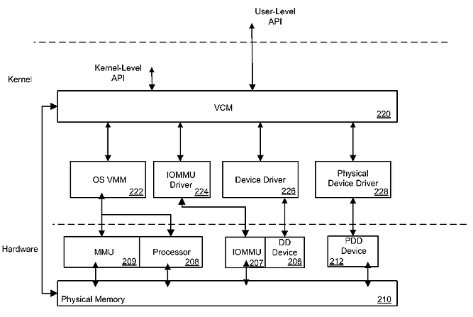

# United States Patent US 8,458,434 B2 UNIFIED VIRTUAL CONTIGUOUS MEMORY MANAGER

This post lists the abstract and links to United States Patent US 8,458,434 B2 UNIFIED VIRTUAL CONTIGUOUS MEMORY MANAGER.

###### Abstract

Disclosed herein are memory management methods and computing devices equipped with memory management capabilities. An exemplary method involves the creation of a first common mapping instance by mapping an address from a physically-mapped device's address space to a first address within a unified address space. This method also encapsulates an existing mapping from a processor's address space to a second address in the shared address space, forming a second common mapping instance. Furthermore, a third common mapping instance is established, linking an address from the address space of a memory-management-unit (MMU) device to a third address in the same shared address space. It's noteworthy that the first, second, and third addresses in the common address space can either be identical or distinct, and that these three common mapping instances can be modified using identical function calls.

###### USPTO Link

[https://image-ppubs.uspto.gov/dirsearch-public/print/downloadPdf/8458434](https://github.com/pfefferz/pfefferz.github.io/blob/main/post/united-states-patent-us-8-458-434-b2-unified-virtual-contiguous-memorymanager/8458434.pdf)

###### A Link to a Local Copy

 [united-states-patent-us-8-458-434-b2-unified-virtual-contiguous-memorymanager.pdf](united-states-patent-us-8-458-434-b2-unified-virtual-contiguous-memorymanager.pdf) 
