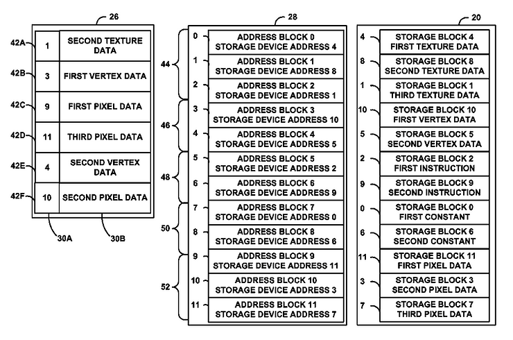

# United States Patent US 9,047,686 B2 DATA STORAGE ADDRESS ASSIGNMENT FOR GRAPHICS PROCESSING

This post lists the abstract and links to United States Patent US 9,047,686 B2 DATA STORAGE ADDRESS ASSIGNMENT FOR GRAPHICS PROCESSING.

Abstract

This disclosure generally pertains to techniques for effectively storing data across various data types used in graphics processing. For instance, a processing unit might allocate a continuous range of addresses to both a first and a second data type. Within these allocated address ranges, the processing unit is designed to store graphics data or addresses pointing to graphics data of either the first or second data type, in respective blocks. Furthermore, the processing unit is equipped to hold in the cache's cache lines both the first and second data type's graphics data.

USPTO Link

https://image-ppubs.uspto.gov/dirsearch-public/print/downloadPdf/9047686

A Link to a Copy

 [united-states-patent-us-9-047-686-b2-data-storage-address-assignment-for-graphics-processing.pdf](united-states-patent-us-9-047-686-b2-data-storage-address-assignment-for-graphics-processing.pdf) 
