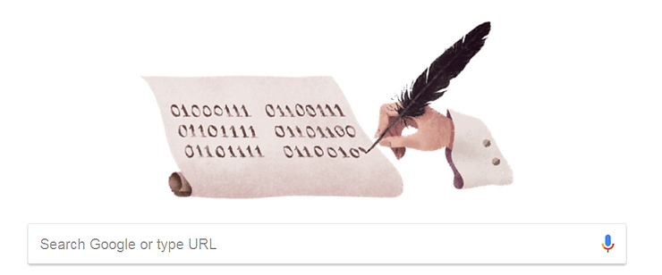

# What does the Google Doodle say?

This post decodes what the Google Doodle says today, July 1st 2018.

**Decoded**

01000111 is **G** 01100111 is **g**

01101111 is **o** 01101100 is **l**

01101111 is **o** 01100101 is **e**

**Expanded**

Gottfried Wilhelm Leibniz is 372 today (or [0b101110100](http://www.google.com/search?q=372+in+binary&oq=372+in+binary&aqs=chrome..69i57j6.2363j0j7&sourceid=chrome&ie=UTF-8) or [0x174](http://www.google.com/search?ei=kwY5W4SnM8uX0gL6qKbQBQ&q=372+in+hex&oq=372+in+hex&gs_l=psy-ab.3...12750.14324.0.14469.9.8.0.0.0.0.0.0..0.0....0...1.1.64.psy-ab..9.0.0....0.zog7kncf8bk) or [1047](http://www.coolmathgames9.com/base/372base10base7.html) in base 7). Google may be celebrating him because he "refined the binary number system, which is the foundation of virtually all digital computers." [[wikipedia](http://en.wikipedia.org/wiki/Gottfried_Wilhelm_Leibniz)\]

**Reference**

ASCII, decimal, hexadecimal, octal, and binary conversion table from IBM at [[link](http://www.ibm.com/support/knowledgecenter/en/ssw_aix_72/com.ibm.aix.networkcomm/conversion_table.htm)\]

The Google page on Gottfried Wilhelm Leibniz at [[link](http://www.google.com/search?site=&q=Gottfried+Wilhelm+Leibniz&oi=ddle&ct=gottfried-wilhelm-leibnizs-372nd-birthday-4525892901535744-l&hl=en&kgmid=/m/0372p&sa=X&ved=0ahUKEwi1lpyZrf7bAhUCM30KHSwPAIUQPQgI&biw=1274&bih=667&dpr=1.25)\]
