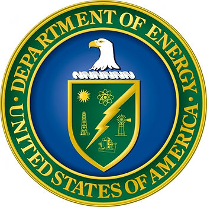
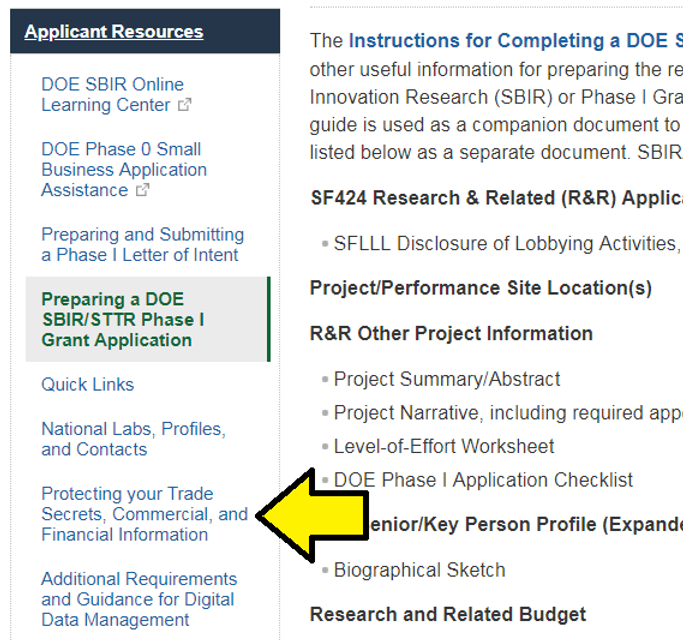

# Where are the "examples of proper IP markings?"

This post lists where the "examples of proper IP markings" referred to in the DoE's FY 2019 PHASE I RELEASE 2 FUNDING OPPORTUNITY ANNOUNCEMENT (FOA) NUMBER:DE-FOA-0001941

**Proper IP Marking Examples**

-   IP Markings Example 1 – Underline Method.docx file (126KB) [[DOE Word doc](http://science.energy.gov/~/media/sbir/word/IP-DOE_Example_Underline_03-10-16.docx)\]\[[My pdf copy](IP-DOE_Example_Underline_03-10-16.pdf)]
    
-   IP Markings Example 2 – Highlight Method.docx file (126KB) [[DOE Word doc](http://science.energy.gov/~/media/sbir/word/IP-DOE_Example_Highlights_03-10-16.docx)\]\[[My pdf copy](IP-DOE_Example_Highlights_03-10-16.pdf)]
    
-   IP Markings Example 3 – Brackets Method.docx file (124KB) [[DOE Word doc](http://science.energy.gov/~/media/sbir/word/IP-DOE_Example_Brackets_03-03-16.docx)\][[My pdf copy](IP-DOE_Example_Brackets_03-03-16.pdf)]
    
-   IP Markings Example 4 – Vertical Line Method.docx file (103KB) [[DOE Word doc](http://science.energy.gov/~/media/sbir/word/IP-DOE_Example_Vertical_08-30-16.docx)\][[My pdf copy](IP-DOE_Example_Vertical_08-30-16.pdf)]
    

I've listed the DoE links as well as links to PDFs I created so that people don't need to open Word docs.

These examples are also useful templates for the **Project Narrative**.

**Finding the Examples**

In the DoE's FY 2019 PHASE I RELEASE 2 FUNDING OPPORTUNITY ANNOUNCEMENT (FOA) NUMBER:DE-FOA-0001941 at [[link](http://science.energy.gov/~/media/grants/pdf/foas/2019/SC_FOA_0001941.pdf)\] the following line is included on p.59:

"To see examples of proper IP markings, please visit the SBIR/STTR Programs web site at [http://science.energy.gov/sbir/applicant-and-awardee-resources/](http://science.energy.gov/sbir/applicant-resources/grant-application/)"

At [http://science.energy.gov/sbir/applicant-and-awardee-resources/](http://science.energy.gov/sbir/applicant-resources/grant-application/) you need to click on:

