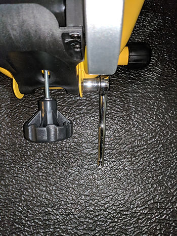

# Zwift for $371.00 + $88.37

This post lists the items I got to use Zwift, how much they cost, a short review of each item after more than a month of use and some pics of set up. The cost listed is for all the equipment + 1 month of Zwift, minus the bike, the computer and Strava.

To use Zwift I got these things at my local Performance bike shop:

-   Mat
    
-   **$40.00** Travel Trac Trainer
    
-   Available at [Performance](http://www.performancebike.com/shop/travel-trac-trainer-mat-40-5923) for $39.99
    
-   Cadence and Speed Sensor
    
-   **$60.00** Wahoo Cadence and Speed Sensor
    
-   Its available from [Amazon](http://www.amazon.com/Wahoo-Cadence-sensor-Android-Computers/dp/B01E0YRQIA) for $70.00 and at [Performance](http://www.performancebike.com/shop/wahoo-rpm-speed-and-cadence-sensor-40-4969) for $59.99
    
-   Heart Rate Monitor
    
-   **$50.00** Wahoo Fitness TICKR Heart Rate Monitor
    
-   Its $49.99 at [Amazon](http://www.amazon.com/Wahoo-TICKR-Heart-Monitor-Bluetooth/dp/B00INQVYZ8) and [Performance](http://www.performancebike.com/shop/wahoo-fitness-tickr-heart-rate-monitor-for-iphone-and-android-40-2756)
    
-   Fluid Stationary Trainer
    
-   Compatible
    
-   **$299.99** CycleOps Fluid2 Trainer
    
-   Got $5 off for "liking" the Performance Store and $32.60 off from my Performance reward points
    
-   Its $299.99 on [Amazon](http://www.amazon.com/CycleOps-9904-Fluid2-Trainer-Black/dp/B00EPM7T1M/ref=sr_1_1?ie=UTF8&qid=1523207457&sr=8-1&keywords=Fluid2) and at $299.99 at [Performance](http://www.performancebike.com/shop/cycleops-fluid2-trainer-40-1408)
    
-   Not compatible:
    
-   **$180.00** CycleOps Fluid Trainer\*
    
-   Its $169.99 on [Amazon](http://www.amazon.com/CycleOps-1021-Fluid-Trainer/dp/B074PZHWK6/ref=sr_1_22?s=outdoor-recreation&ie=UTF8&qid=1522915415&sr=1-22&refinements=p_4%3ACycleOps) and $179.99 at [Performance](http://www.performancebike.com/shop/brands/cycleops/cycleops-fluid-trainer-40-5885)
    
-   Wheel lift a.k.a. Riser Block
    
-   **$26.00** CycleOps Climbing Block
    
-   Available at [Amazon](http://www.amazon.com/CycleOps-Stackable-Climbing-Bicycle-Trainers/dp/B000BT8VPQ/ref=sr_1_3?ie=UTF8&qid=1522915593&sr=8-3&keywords=cycleops+climbing+block) for $24.25 and at [Performance](http://www.performancebike.com/shop/cycleops-climbing-block-40-3558) for $29.99
    

I also run the Zwift Helper App on my Google Pixel, the Zwift program on my T460 and use Strava to save the rides. The T460's specs are [here](http://www.zachpfeffer.com/single-post/2017/01/28/New-T460-System-Information). My Strava profile is [here](http://www.strava.com/athletes/5781977). Strava is **$60.00** per year. Zwift is $15.00 per month (**$180.00** per year).

\*Asked Zwift and CycleOps if this trainer is equivalent to the Fluid 2.

Answer on Apr 8th 2017: From Zwift support: No. The Fluid is not compatible. You need to get the Fluid2.

**Tips**

I would suggest visiting your local bike shop to get everything you need to use Zwift. They will likely have a Zwift setup you can try and everything you need to get started.

**Some Things I've Learned**

-   I'm getting my heart-rate up a lot, more than if I didn't have Zwift
    
-   You don't get to ride "anywhere"
    
-   Zwift only has 3 maps: Watopia, London and Richmond. These maps are on a rotation and there are only a small set of roads in these locations you get to ride (except Watopia - you get to ride all the roads there).
    
-   To get things going and to make sure all the sensors sync up do these steps:
    

1.  Launch the game
    
2.  Launch the helper on the phone
    
3.  Spin the crank and the wheel
    
4.  Put on the heart rate monitor
    
5.  Wait between 30 secs and a min
    
6.  If the sensors don't sync up, logout of the Zwift Helper App and log back in.
    

**Mat**

I got the Travel Trac Trainer Mat on sale for $39.99 (was $49.99). It was not available at [Amazon](http://www.amazon.com/Travel-Trac-Trainer-Mat/dp/B017MDMEHY), but was available at [Performance](http://www.performancebike.com/shop/travel-trac-trainer-mat-40-5923) for $39.99.

Rolled up:

Unrolled:

Review

After a month the mat seems okay. The bike, trainer and riser **press down** the mat material a lot. This seems to lock everything in place, but it also makes re-positioning things a bit tough (which I've needed to do a few times). Overall the mat seems a little "cheap" but is functional.

**Cadence and Speed Sensor**

I got the Wahoo Cadence and Speed Sensor pack for $59.99. Its available from [Amazon](http://www.amazon.com/Wahoo-Cadence-sensor-Android-Computers/dp/B01E0YRQIA) for $70.00 and at [Performance](http://www.performancebike.com/shop/wahoo-rpm-speed-and-cadence-sensor-40-4969) for $59.99.

Front of the package:

Back of the package:

Review

After a month of indoor use these seem to work okay. Installing the speed sensor was a little difficult, you need to secure a rubber strap around a hub, between wheel spokes. Just needed to take my time.

Pictures of Set Up

**Heart Rate Monitor**

I already had the heart rate monitor, a Wahoo Fitness TICKR. Its $49.99 at [Amazon](http://www.amazon.com/Wahoo-TICKR-Heart-Monitor-Bluetooth/dp/B00INQVYZ8) and [Performance](http://www.performancebike.com/shop/wahoo-fitness-tickr-heart-rate-monitor-for-iphone-and-android-40-2756).

Review

This is my second TICKR in 3 years. The first one quit after about 1.5 years. Overall I've used this a lot to track heart rate both on Zwift and outside.

**Fluid2 Stationary Trainer**

I picked up the Fluid2 after the Zwift told me the Fluid was not compatible with Zwift.

Review

It seems to offer about 30% more resistance than the Fluid.

Pictures of Set Up

**Wheel lift a.k.a. Riser Block**

I got the CycleOps Climbing Block for $25.99. Its available at [Amazon](http://www.amazon.com/CycleOps-Stackable-Climbing-Bicycle-Trainers/dp/B000BT8VPQ/ref=sr_1_3?ie=UTF8&qid=1522915593&sr=8-3&keywords=cycleops+climbing+block) for $24.25 and at [Performance](http://www.performancebike.com/shop/cycleops-climbing-block-40-3558) for $29.99.

Review

This riser works really good. Its very sturdy and holds my front wheel very well.

**Archive**

**Fluid Stationary Trainer**

**Leaving the following here for reference. The Fluid is not compatible with the Fluid2.**

I got the CycleOps Fluid trainer on sale for $179.99. I got this trainer after the guy at the Performance bike shop pointed out that a fluid trainer feels more natural than a magnetic resistance trainer. I was hesitant because I had read some reviews that these trainers start to leak. He said he hadn't had any problems. Its $169.99 on [Amazon](http://www.amazon.com/CycleOps-1021-Fluid-Trainer/dp/B074PZHWK6/ref=sr_1_22?s=outdoor-recreation&ie=UTF8&qid=1522915415&sr=1-22&refinements=p_4%3ACycleOps) and $179.99 at [Performance](http://www.performancebike.com/shop/brands/cycleops/cycleops-fluid-trainer-40-5885).

Having ridden a Tacx magnetic resistance trainer, I do like the fluid trainer better. It does feel more natural and you don't need to shift the resistance up and down.

T**he following is wrong. The fluid is not the same as the Fluid2:**

Note: you'll need to select the CycleOps Fluid 2 trainer in Zwift. They don't list a "Fluid" without the 2. I've looked this up. The box says its compatible and there are some posts online that seem to confirm that its the same. I'm checking with Zwift and CycleOps on this point.

Review

After about a month this trainer seems to be holding up. I haven't seen any leaks. The noise seems about right.

Pictures of Setup

